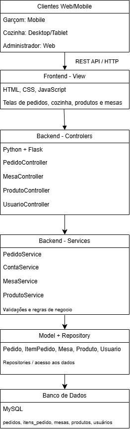
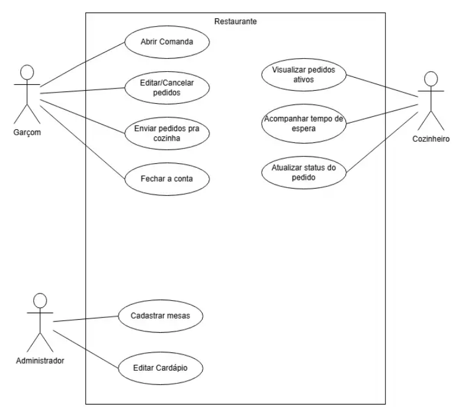
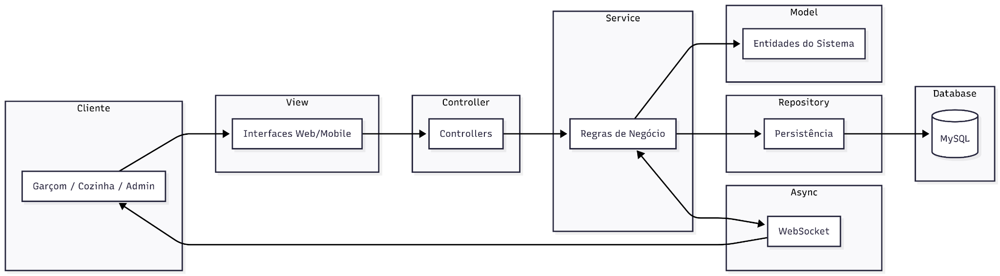
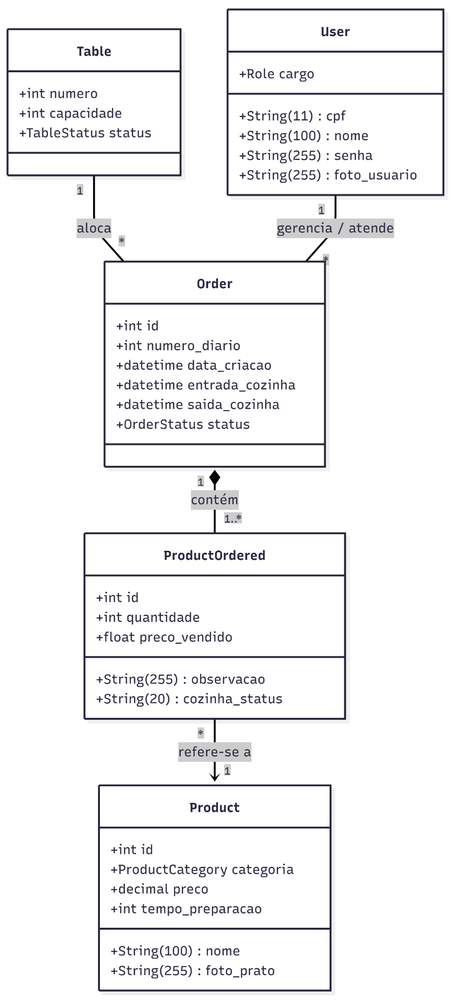
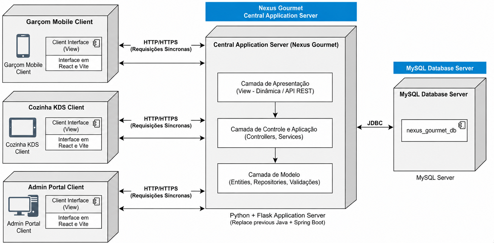

# Documento de Arquitetura

**Versão 1.4**

## Integrantes do Grupo

| Matrícula   | Nome                                                | Função (responsabilidade) | Pontos de participação |
|-------------|-----------------------------------------------------|---------------------------|------------------------|
| 242004457   | Alexandre Henrique Almeida Valadares Sousa          | Banco de dados            | 10                     |
| 242028655   | Davi Kenichi Watanabe Sakai                         | Frontend                  | 10                     |
| 241025953   | Igor Lima Carneiro                                  | Backend                   | 10                     |
| 242005329   | Jhonatan William Araújo de Almeida                  | Banco de dados            | 10                     |
| 242015432   | João Gabriel Rolim Veiga                            | Backend                   | 10                     |
| 241039322   | João Paulo Jacomini Batista                         | Frontend                  | 10                     |
| 241039304   | João Victor Amorim Kurihara                         | Frontend                  | 10                     |
| 242024253   | Lucas Ferreira Santana                              | Backend                   | 10                     |
| 242024271   | Lucas Peixoto Rodrigues                             | Backend                   | 10                     |
| 242005006   | Rafael de Aquino Marinho                            | Frontend/ MkDocs          | 10                     |

## Histórico de Revisões

| Data       | Versão | Descrição                                                                                     | Autor(es)             |
|------------|--------|-----------------------------------------------------------------------------------------------|-----------------------|
| 14/05/2026 | 1.0    | Primeira versão do documento que define a arquitetura usada no produto                        | Grupo Dijkstra        |
| 02/06/2026 | 1.1    | Adicionado menções diretas no corpo do documento às fontes bibliográficas usadas              | Grupo Dijkstra        |
| 28/06/2026 | 1.2    | Melhorando explicação figuras e diagramas, corrigindo escopo                                 | Rafael                |
| 29/06/2026 | 1.3    |Atualização para refletir a implementação real (MySQL, estrutura de pastas, serviços/controladores, remoção do WebSocket) | Rafael                |

---

## Sumário

- [1 Introdução](#1-introducao)
  - [1.1 Propósito](#11-proposito)
  - [1.2 Escopo](#12-escopo)
- [2 Representação Arquitetural](#2-representacao-arquitetural)
  - [2.1 Definições](#21-definicoes)
  - [2.2 Justifique sua escolha](#22-justifique-sua-escolha)
  - [2.3 Detalhamento](#23-detalhamento)
  - [2.4 Metas e restrições arquiteturais](#24-metas-e-restricoes-arquiteturais)
  - [2.5 Visões](#25-visoes)
    - [2.5.1 Visão de uso (o escopo do sistema)](#251-visao-de-uso-o-escopo-do-sistema)
    - [2.5.2 Visão de organização lógica](#252-visao-de-organizacao-logica)
    - [2.5.3 Visão estrutural](#253-visao-estrutural)
  - [2.6 Visão de Implantação](#26-visao-de-implantacao)
  - [2.7 Restrições adicionais](#27-restricoes-adicionais)
- [3 Bibliografia](#3-bibliografia)

---

## 1. Introdução

### 1.1 Propósito

Este documento descreve a arquitetura do sistema sendo desenvolvido pelo grupo Dijkstra, na disciplina de MDS – Métodos de Desenvolvimento de Software – edição do primeiro semestre de 2026, para o sistema Nexus Gourmet, a fim de fornecer uma visão abrangente do sistema para desenvolvedores, testadores e demais interessados em aspectos relacionados às tecnologias a serem usadas no desenvolvimento.

### 1.2 Escopo

O detalhamento do escopo se encontra no documento de arquitetura, este, juntamente com o documento de Visão do produto e do projeto. Porém, em linhas gerais o escopo do produto compreende o desenvolvimento de um software capaz de registrar e organizar pedidos em restaurantes, como apresentado mais detalhadamente na tabela 1 a seguir:

**Tabela 1 - Funcionalidades presentes e não presentes**

| O que ele faz                     | O que ele não faz                        |
|-----------------------------------|------------------------------------------|
| Abrir pedido para mesa            | Compra e venda de produtos               |
| Adicionar item à comanda          | Adicionar conta de consumidor            |
| Remover item da comanda           | Permitir acesso direto de consumidores   |
| Enviar pedido para a cozinha      |                                          |
| Visualizar pedidos na cozinha     |                                          |
| Visualizar tempo de espera        |                                          |
| Atualizar status da comanda       |                                          |
| Fechar conta                      |                                          |
| Calcular total da comanda         |                                          |
| Visualizar mesas                  |                                          |
| Cadastrar comanda                 |                                          |
| Editar comanda                    |                                          |
| Gerenciamento de Usuário          |                                          |

*Fonte: elaborado pelo autor (2026)*

---

## 2. Representação Arquitetural

### 2.1 Definições

O sistema Nexus Gourmet segue uma arquitetura **Cliente-Servidor Web**, organizada internamente segundo o padrão **MVC em camadas**, com comunicação síncrona via HTTP para todas as operações, incluindo atualização de status de pedidos.

A escolha da arquitetura Cliente-Servidor ocorre porque o sistema será acessado por diferentes tipos de clientes, como dispositivos móveis utilizados pelos garçons, telas utilizadas pela cozinha e interfaces administrativas (IBM, 2026). Esses clientes consomem os serviços oferecidos por uma aplicação central, responsável por processar as regras de negócio, controlar o fluxo dos pedidos e acessar o banco de dados.

Internamente, o servidor é organizado segundo o padrão **MVC (Model-View-Controller)**. Nesse modelo:

- **View:** interfaces do sistema (desenvolvidas em React ou templates HTML).
- **Controller:** recebe as requisições dos usuários e coordena o fluxo das operações.
- **Model:** representa os dados, regras de negócio e persistência relacionados a pedidos, mesas, produtos, usuários e status de atendimento.

A comunicação entre as camadas é feita via **API REST** sobre HTTP/HTTPS, com todas as requisições sendo síncronas.

### 2.2 Justifique sua escolha

A escolha da arquitetura Cliente-Servidor Web com organização interna MVC é adequada ao Nexus Gourmet porque o produto proposto não é um sistema isolado em uma única máquina, mas uma aplicação distribuída entre diferentes usuários e dispositivos. O documento de Visão do Produto define o Nexus Gourmet como uma aplicação web-mobile voltada a proprietários e funcionários de restaurantes, com a finalidade de registrar, acompanhar e gerenciar pedidos de forma centralizada, ágil e sem erros.

O problema central identificado no projeto está relacionado à falha de comunicação entre salão e cozinha, à perda de informações em comandas de papel e à falta de rastreabilidade dos pedidos. Por isso, a arquitetura precisa favorecer a centralização das informações, o acesso simultâneo por múltiplos perfis de usuário e a atualização rápida do estado dos pedidos. A organização Cliente-Servidor atende diretamente a essa necessidade, pois separa os dispositivos consumidores dos serviços da aplicação central, mantendo o processamento e os dados em um servidor comum.

Essa escolha é adequada ao Nexus Gourmet porque o sistema possui características típicas de uma aplicação distribuída e modular, na qual diferentes usuários interagem simultaneamente com uma aplicação centralizada. O modelo Cliente-Servidor permite separar claramente os dispositivos de acesso da camada responsável pelo processamento das regras de negócio e armazenamento dos dados, favorecendo a organização, controle e sincronização das operações realizadas no restaurante.

No contexto do Nexus Gourmet, essa separação é importante porque o sistema será utilizado por diferentes perfis, como garçons, cozinha e administradores, cada um acessando funcionalidades específicas por meio de navegadores ou dispositivos conectados à aplicação principal. Dessa forma, a centralização do processamento e das informações garante maior consistência no gerenciamento de pedidos, mesas, produtos e status de atendimento.

Para complementar essa estrutura, o sistema adotará o padrão MVC (Model-View-Controller) como organização interna da aplicação. Essa abordagem favorece a separação de responsabilidades entre interface, controle do fluxo da aplicação e manipulação dos dados, tornando o sistema mais organizado e compreensível.

A camada View será responsável pela interação com os usuários, apresentando telas e funcionalidades voltadas ao gerenciamento dos pedidos e operações do restaurante. A camada Controller coordenará o fluxo das requisições e regras de negócio, intermediando a comunicação entre interface e persistência. Já a camada Model concentrará as entidades e dados relacionados ao domínio do sistema, como pedidos, mesas, produtos e usuários.

Essa organização contribui diretamente para a manutenção e evolução do software, reduzindo o acoplamento entre partes do sistema e facilitando alterações futuras sem impacto excessivo em outros módulos. Além disso, a divisão clara das responsabilidades melhora o desenvolvimento paralelo entre as equipes de frontend, backend e banco de dados, permitindo maior produtividade e facilidade de integração.

Outro fator relevante é a necessidade de atualização rápida das informações entre salão e cozinha. Como o sistema exige acompanhamento contínuo dos pedidos e alteração dinâmica de status, a arquitetura adota comunicação síncrona via HTTP para garantir a consistência dos dados em tempo real, com atualizações refletidas após cada requisição.

Assim, a combinação entre Cliente-Servidor e MVC oferece uma solução adequada às necessidades funcionais e estruturais do Nexus Gourmet, equilibrando organização, modularidade, manutenção, escalabilidade e eficiência operacional.

### 2.3 Detalhamento

A arquitetura proposta pode ser representada em quatro partes principais:

- **Clientes Web** - Representam os dispositivos usados pelos perfis do sistema:
  - **Garçom:** abre pedidos, adiciona/remove itens, envia pedidos para a cozinha e fecha contas.
  - **Cozinha:** visualiza pedidos ativos, acompanha tempo de espera e atualiza status.
  - **Administrador:** cadastra e edita produtos, mesas e demais dados necessários à operação.

- **Camada de Apresentação - View**
  - Corresponde às páginas e interfaces desenvolvidas em **React** (ou templates HTML). Essa camada é responsável por apresentar as telas ao usuário e capturar suas ações, como clicar em "enviar pedido", "adicionar item" ou "marcar como pronto".

- **Camada de Controle e Aplicação - Controller/Service**
  - Corresponde ao backend da aplicação, desenvolvido em **Python com Flask** e **SQLAlchemy**.
  - Os **controladores** (`order_controller`, `product_controller`, `user_controller`) recebem as requisições HTTP e orquestram as ações.
  - Os **serviços** (`order_service`, `product_service`, `user_service`, `mesa_service`) contêm as regras de negócio, validações e cálculos.
  - A padronização de respostas da API é feita por meio de mensagens de erro e sucesso centralizadas.

- **Camada de Modelo e Persistência - Model/Database**
  - Representa os dados e regras centrais do sistema.
  - As entidades principais (**User**, **Table**, **Product**, **Order**, **ItemOrdered**) estão definidas no arquivo `models/models.py`.
  - Os valores enumerados (cargos, status, categorias) estão no arquivo `models/enums.py`.
  - **Não há uma camada explícita de Repository**; o acesso ao banco de dados é realizado diretamente pelos serviços, utilizando **SQLAlchemy**.
  - O banco de dados utilizado é **MySQL**, conforme script `database.sql`.

**Figura 1 - estilo arquitectural**

*Fonte: elaborado pelos autores (2026)*

O fluxo principal começa quando o garçom acessa a interface web/mobile e registra um pedido vinculado a uma mesa. A View envia a solicitação ao Controller por meio de HTTP/HTTPS. O Controller aciona o Service correspondente, que valida as regras de negócio, como existência da mesa, disponibilidade do produto e cálculo dos valores. Em seguida, o Service persiste os dados no banco MySQL via SQLAlchemy.

Quando o pedido é enviado para a cozinha, o sistema altera seu status e disponibiliza essa alteração para a tela da cozinha. As atualizações de status são realizadas por requisições HTTP, que refletem as mudanças após o recarregamento da página ou por meio de polling periódico.

Quando o cozinheiro altera o status do pedido para "em preparo" ou "pronto", o fluxo ocorre no sentido inverso: a View da cozinha envia a atualização ao Controller, o Service valida a mudança de estado e o banco de dados é atualizado. A interface do garçom pode então visualizar o novo status do pedido após recarregar a página.

**Tabela 2 - Responsabilidades por camada**

| Elemento                 | Responsabilidade no Nexus Gourmet                                                          |
|--------------------------|-------------------------------------------------------------------------------------------|
| Cliente Web/Mobile       | Permitir interação dos usuários com o sistema em diferentes dispositivos                  |
| View                     | Exibir telas, formulários, botões, listas de pedidos, mesas e produtos                    |
| Controller               | Receber requisições HTTP, coordenar o fluxo e encaminhar ações aos serviços               |
| Service                  | Aplicar regras de negócio, validações e cálculos                                          |
| Model                    | Representar as entidades principais do domínio (User, Table, Product, Order, etc.)        |
| Banco de Dados           | Persistir pedidos, produtos, mesas, usuários e histórico de status (MySQL)                |

*Fonte: elaborado pelos autores (2026)*

### 2.4 Metas e restrições arquiteturais

Esta seção define metas e restrições arquiteturais que o sistema deve seguir.

- **Desempenho de Interface:** As atualizações de status de um pedido devem ser refletidas na tela da cozinha em tempo próximo ao real, utilizando requisições HTTP síncronas para refletir as mudanças de status.

- **Confiabilidade de Dados:** O sistema deve garantir a persistência dos pedidos mesmo em cenários de queda momentânea da internet. Para isso, a camada de apresentação (View) deve implementar mecanismos de armazenamento local temporário (cache/LocalStorage) até que a rota da API no backend (Flask) esteja disponível para consolidar os dados no banco MySQL.

- **Restrições de Rede:** O software deve ser otimizado para operar prioritariamente sob a infraestrutura de rede local (Wi-Fi) do restaurante, minimizando requisições externas supérfluas para garantir que o tempo de tráfego de dados do salão até o sistema KDS (Kitchen Display System) da cozinha seja imperceptível ao usuário.

- **Escalabilidade e Concorrência:** O sistema deve ser capaz de suportar o acesso simultâneo de ao menos 15 usuários logados (entre garçons e cozinheiros), garantindo a estabilidade e a sincronização dos dados em tempo real.

- **Restrição de Segurança/Acesso:** É obrigatória a identificação (login) de qualquer funcionário para que o sistema permita a realização de operações de pedido. A autenticação é gerenciada pelo `user_service`, utilizando sessões Flask.

- **Usabilidade Física:** Devido ao contexto dos garçons, o design da interface no dispositivo móvel tem a meta de possibilitar a operação e uso com apenas uma das mãos.

- **Métrica de Qualidade de Código:** O sistema adota como meta técnica manter uma densidade de defeitos máxima de \(0,5\%\) (erros por mil linhas de código - KLOC) mensurada durante a execução dos testes unitários e de integração na branch de homologação.

### 2.5 Visões

#### 2.5.1 Visão de uso (o escopo do sistema)

O escopo do sistema Nexus Gourmet abrange o desenvolvimento de uma aplicação distribuída, com interfaces web e mobile, destinada à centralização e otimização do registro e gerenciamento de pedidos em ambientes gastronômicos. O fluxo operacional da aplicação engloba o ciclo completo do atendimento: a abertura da mesa e a inserção de itens pelo garçom; o envio simultâneo do pedido para a interface da cozinha, o monitoramento do tempo de preparo e a atualização de status ("em preparo" ou "pronto") pela equipe de cozinheiros, e, por fim, o encerramento da conta da mesa.

A definição do estilo arquitetural Cliente-Servidor Web, aliada ao padrão estrutural Model-View-Controller (MVC), foi fundamentada primordialmente nos requisitos operacionais do ambiente de implantação. A necessidade de mitigar falhas de comunicação históricas entre o salão e a cozinha exigiu uma arquitetura que garantisse a centralização das informações e o acesso simultâneo. Adicionalmente, a pluralidade de perfis de acesso sistêmico caracterizada pelo uso de dispositivos móveis pelos garçons, telas ou tablets na cozinha e interfaces web exclusivas para a administração justificou a separação lógica das interfaces gráficas (camada View) do processamento das regras de negócio e da persistência de dados.

**Figura 2 - Diagrama de Casos de Uso**

*Fonte: Elaborado pelos autores (2026)*

As mudanças de status são refletidas após recarregamento manual ou por meio de polling periódico, garantindo a consistência das informações.

#### 2.5.2 Visão de organização lógica

O sistema é subdividido nos seguintes módulos, conforme implementado:

- **Módulo de Apresentação (View):**
  - **Composição:** Desenvolvido com **React** (ou templates HTML).
  - **Razão Lógica:** Responsável unicamente pela interface com o usuário, apresentando as diferentes telas (mobile para garçom, desktop para cozinha) e capturando ações como "enviar pedido" ou "marcar como pronto".

- **Módulo de Controle e Serviços (Controller/Service):**
  - **Composição:** Desenvolvido em linguagem **Python** utilizando o framework **Flask**, com auxílio do **SQLAlchemy**.
  - **Controladores:** `order_controller`, `product_controller`, `user_controller` – recebem as requisições e orquestram as ações.
  - **Serviços:** `order_service`, `product_service`, `user_service`, `mesa_service` – contêm as regras de negócio, validações e cálculos.
  - **Razão Lógica:** Coordenam todo o fluxo da aplicação, recebem as requisições das telas, efetuam validações, aplicam regras de negócio (cálculos de contas, existência da mesa) e determinam as ações para persistência.

- **Módulo de Modelo e Persistência (Model/Database):**
  - **Composição:** Composto pelas entidades fundamentais do sistema (arquivo `models/models.py`), pelos enums (`models/enums.py`) e pelo banco de dados **MySQL** (script `database.sql`).
  - **Razão Lógica:** Modela o domínio (User, Table, Product, Order, ItemOrdered) e garante a integridade e persistência física dos dados, utilizando SQLAlchemy para abstração do banco.

**Como eles se comunicam (Interfaces):**

A camada de Apresentação (View) comunica-se com os Controladores (backend) através de API REST utilizando o protocolo HTTP/HTTPS. Atualmente, a comunicação entre as camadas é feita exclusivamente via requisições HTTP síncronas.

Internamente, o Controller utiliza a camada de Service (regras de negócio) para se comunicar de maneira contínua com o Model (SQLAlchemy), que por sua vez persiste e consulta as informações diretamente no banco de dados MySQL.

**Figura 3 - Diagrama de Pacotes**

*Fonte: Elaborado pelos autores (2026)*

#### 2.5.3 Visão estrutural

**Figura 4 - Diagrama de Classes**

A Figura 4 ilustra o Diagrama de Classes, delimitando o escopo do produto e as interações entre os atores externos e as funcionalidades do sistema.

**Detalhamento dos Atores e Interações:**

- **Atores Primários:** O diagrama identifica três perfis distintos com responsabilidades segregadas: Administrador, Garçom e Cozinheiro. Essa separação é refletida na arquitetura de segurança e controle de acesso do sistema, implementada via `user_service` e `enums.py`.

- **Gestão de Pedidos (Garçom/Cozinheiro):** O núcleo operacional do sistema é representado pelos casos de uso "Fazer pedido", "Visualizar pedidos" e "Atualizar status do pedido". A interação entre esses atores através do sistema mitiga falhas de comunicação e agiliza o tempo de atendimento.

- **Gestão Administrativa (Administrador):** O ator administrador possui permissões exclusivas para a manutenção do ecossistema, incluindo "Gerenciar mesas", "Gerenciar produtos" e "Gerenciar usuários", garantindo a integridade dos dados cadastrais utilizados nas operações de salão.

- **Fechamento de Ciclo:** O caso de uso "Fechar conta" encerra o fluxo operacional, integrando as seleções feitas pelo garçom com o cálculo financeiro final, conforme as regras de negócio estabelecidas.

**Relevância Arquitetural:**

O mapeamento da Figura 4 serve como base para a definição das rotas da API no backend e para a construção das interfaces no frontend. Cada caso de uso representado foi priorizado para atender aos requisitos funcionais e garantir que a arquitetura lógica suporte a carga de trabalho simultânea de múltiplos atores.

*Fonte: Elaborado pelos autores (2026)*

### 2.6 Visão de Implantação

A visão de implantação descreve como os componentes do sistema serão distribuídos fisicamente nos ambientes operacionais do restaurante, evidenciando o modelo Cliente-Servidor adotado e os mecanismos de comunicação que garantem a sincronização em tempo real entre salão e cozinha. A Figura 5 ilustra essa topologia, destacando os principais nós de hardware, os papéis de cada dispositivo e os protocolos de rede utilizados.

#### 2.6.1 Dispositivos Clientes

A aplicação atende três perfis de uso, cada um com dispositivos e interfaces específicas:

- **Interface Mobile (Garçom):**

Os garçons utilizam smartphones ou tablets com navegador web para acessar a interface otimizada para toque. O fluxo operacional inicia-se com a autenticação do usuário. Após o login, o garçom pode selecionar uma mesa, abrir uma comanda, adicionar ou remover itens e, por fim, enviar o pedido à cozinha. A ação "Confirmar/Enviar" dispara uma requisição HTTP para a API central, que registra o pedido e a cozinha visualiza a atualização após recarregar a página.

- **Interface Desktop (Cozinha - KDS):**

A cozinha utiliza um sistema de display (Kitchen Display System - KDS), normalmente executado em tablets ou monitores fixos. Essa interface exibe a lista de pedidos ativos, organizada por status ("em preparo" e "pronto"), com destaque para o tempo de espera de cada comanda. O cozinheiro interage com o sistema para marcar um pedido como "em preparo" ou "pronto", ações que atualizam o estado e são refletidas na interface do garçom (por recarregamento ou polling). Essa transição elimina a necessidade de comandas de papel e reduz a carga cognitiva da equipe.

- **Interface Administrativa (Desktop/Web):**

O administrador acessa uma interface web completa para gerenciar o cardápio (cadastro, edição e remoção de produtos) e configurar as mesas do salão. Esse perfil também pode gerenciar usuários e visualizar relatórios operacionais. O acesso é feito via navegador em computadores fixos ou notebooks.

#### 2.6.2 Servidor de Aplicação

O servidor central hospeda a aplicação backend desenvolvida em Python com o framework Flask. Ele é responsável por:

- Processar as requisições REST provenientes dos clientes (autenticação, operações de comanda, gestão de produtos e mesas);
- Executar as regras de negócio (validações, cálculos de total, controle de fluxo de status) por meio dos serviços;
- Coordenar o acesso ao banco de dados via SQLAlchemy.

O servidor pode ser implantado em uma máquina dedicada na rede local do restaurante (para menor latência) ou em nuvem. A comunicação com os clientes é feita exclusivamente via protocolo HTTP/HTTPS.

#### 2.6.3 Banco de Dados

O banco de dados utilizado é **MySQL**, conforme script `database.sql`. Ele persiste todas as informações do sistema:

- Dados cadastrais (produtos, mesas, usuários);
- Comandas e itens associados;
- Histórico de status e transações financeiras.

O banco é mantido em um servidor separado ou no mesmo servidor da aplicação, garantindo persistência e segurança.

#### 2.6.4 Conectores e Protocolos

A comunicação entre os componentes segue os seguintes padrões:

- **Cliente ↔ Servidor de Aplicação:**

Requisições síncronas (abrir comanda, adicionar item, fechar conta, atualizar status) utilizam o protocolo HTTP/HTTPS com uma API RESTful.

- **Servidor de Aplicação ↔ Banco de Dados:**

A comunicação ocorre por meio do SQLAlchemy, que abstrai o driver MySQL (conexão TCP/IP com credenciais específicas).

**Figura 5 - Diagrama de Implantação**

*Fonte: Elaborado pelos autores (2026)*

A Figura 5 representa graficamente a topologia descrita. No lado esquerdo, vemos os clientes agrupados por perfil: smartphones/tablets dos garçons, displays da cozinha e computadores administrativos. Todos se conectam, via rede local ou internet, ao servidor de aplicação central, que está ligado ao banco de dados MySQL. As setas indicam os protocolos utilizados - HTTP/HTTPS para requisições síncronas. Essa arquitetura garante que o envio de um pedido pelo garçom seja registrado e disponibilizado para a cozinha, mantendo a equipe sincronizada.

### 2.7 Restrições adicionais

Esta seção detalha limitações e requisitos de qualidade que o sistema deve seguir.

- **Aspectos negociais:**

O software será acessível diretamente pela Internet e otimizado para a rede local do estabelecimento para evitar latência no envio de pedidos para cozinha. O produto exigirá obrigatoriamente a identificação e login do usuário (funcionário do restaurante) para qualquer operação de pedido. A autenticação é gerenciada pelo `user_service`, utilizando sessões Flask.

- **Características de Qualidade de Software:**

  - **Confiabilidade:** Caso haja uma queda momentânea de conexão, o sistema não deve perder dados de pedidos. Para isso, a camada de apresentação pode implementar cache local (LocalStorage) para reenvio posterior.
  - **Usabilidade:** A interface seguirá padrões de design que possibilitem o uso com apenas uma mão, no caso dos garçons, facilitando o trabalho deles.

---

## 3. Bibliografia

IBM. Modelo cliente/servidor. IBM Documentation, [s. d.]. Disponível em: [https://www.ibm.com/docs/pt-br/cics-ts/5.6.0?topic=programs-clientserver-model](https://www.ibm.com/docs/pt-br/cics-ts/5.6.0?topic=programs-clientserver-model). Acesso em: 14 maio 2026.

SERRANO, Milene. Arquitetura de Software: Visão Geral. [S.l.]: Engenharia de Software UnB/FGA, 2026. 1 arquivo (70 slides), PDF.