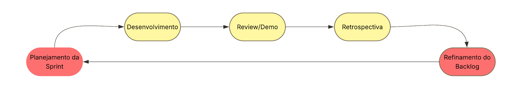

<h1 id="documento-de-visao">Documento de Visão</h1>

<strong>Nexus Gourmet</strong>

Versão 1.1

<h2 id="integrantes-do-grupo">Integrantes do Grupo</h2>

<table style="border-collapse: collapse; width: 100%; font-size: 0.95em;">
  <thead>
    <tr style="background-color: #f2f2f2;">
      <th style="border: 1px solid #ddd; padding: 8px;">Matrícula</th>
      <th style="border: 1px solid #ddd; padding: 8px;">Nome</th>
      <th style="border: 1px solid #ddd; padding: 8px;">Função (responsabilidade)</th>
      <th style="border: 1px solid #ddd; padding: 8px;">Pontos de participação</th>
    </tr>
  </thead>
  <tbody>
    <tr><td style="border: 1px solid #ddd; padding: 8px;">242004457</td><td style="border: 1px solid #ddd; padding: 8px;">Alexandre Henrique Almeida Valadares Sousa</td><td style="border: 1px solid #ddd; padding: 8px;">Banco de dados</td><td style="border: 1px solid #ddd; padding: 8px;">10</td></tr>
    <tr><td style="border: 1px solid #ddd; padding: 8px;">242028655</td><td style="border: 1px solid #ddd; padding: 8px;">Davi Kenichi Watanabe Sakai</td><td style="border: 1px solid #ddd; padding: 8px;">Frontend</td><td style="border: 1px solid #ddd; padding: 8px;">10</td></tr>
    <tr><td style="border: 1px solid #ddd; padding: 8px;">241025953</td><td style="border: 1px solid #ddd; padding: 8px;">Igor Lima Carneiro</td><td style="border: 1px solid #ddd; padding: 8px;">Backend</td><td style="border: 1px solid #ddd; padding: 8px;">10</td></tr>
    <tr><td style="border: 1px solid #ddd; padding: 8px;">242005329</td><td style="border: 1px solid #ddd; padding: 8px;">Jhonatan William Araújo de Almeida</td><td style="border: 1px solid #ddd; padding: 8px;">Banco de dados</td><td style="border: 1px solid #ddd; padding: 8px;">10</td></tr>
    <tr><td style="border: 1px solid #ddd; padding: 8px;">242015432</td><td style="border: 1px solid #ddd; padding: 8px;">João Gabriel Rolim Veiga</td><td style="border: 1px solid #ddd; padding: 8px;">Backend</td><td style="border: 1px solid #ddd; padding: 8px;">10</td></tr>
    <tr><td style="border: 1px solid #ddd; padding: 8px;">241039322</td><td style="border: 1px solid #ddd; padding: 8px;">João Paulo Jacomini Batista</td><td style="border: 1px solid #ddd; padding: 8px;">Frontend</td><td style="border: 1px solid #ddd; padding: 8px;">10</td></tr>
    <tr><td style="border: 1px solid #ddd; padding: 8px;">241039304</td><td style="border: 1px solid #ddd; padding: 8px;">João Victor Amorim Kurihara</td><td style="border: 1px solid #ddd; padding: 8px;">Frontend</td><td style="border: 1px solid #ddd; padding: 8px;">10</td></tr>
    <tr><td style="border: 1px solid #ddd; padding: 8px;">242024253</td><td style="border: 1px solid #ddd; padding: 8px;">Lucas Ferreira Santana</td><td style="border: 1px solid #ddd; padding: 8px;">Backend</td><td style="border: 1px solid #ddd; padding: 8px;">10</td></tr>
    <tr><td style="border: 1px solid #ddd; padding: 8px;">242024271</td><td style="border: 1px solid #ddd; padding: 8px;">Lucas Peixoto Rodrigues</td><td style="border: 1px solid #ddd; padding: 8px;">Backend</td><td style="border: 1px solid #ddd; padding: 8px;">10</td></tr>
    <tr><td style="border: 1px solid #ddd; padding: 8px;">242005006</td><td style="border: 1px solid #ddd; padding: 8px;">Rafael de Aquino Marinho</td><td style="border: 1px solid #ddd; padding: 8px;">Frontend</td><td style="border: 1px solid #ddd; padding: 8px;">10</td></tr>
  </tbody>
</table>

<h2 id="historico-de-revisoes">Histórico de Revisões</h2>

<table style="border-collapse: collapse; width: 100%;">
  <thead>
    <tr style="background-color: #f2f2f2;">
      <th style="border: 1px solid #ddd; padding: 8px;">Data</th>
      <th style="border: 1px solid #ddd; padding: 8px;">Versão</th>
      <th style="border: 1px solid #ddd; padding: 8px;">Descrição</th>
      <th style="border: 1px solid #ddd; padding: 8px;">Autor</th>
    </tr>
  </thead>
  <tbody>
    <tr><td style="border: 1px solid #ddd; padding: 8px;">30/04/2026</td><td style="border: 1px solid #ddd; padding: 8px;">1.0</td><td style="border: 1px solid #ddd; padding: 8px;">Criação da primeira versão do documento</td><td style="border: 1px solid #ddd; padding: 8px;">Grupo Dijkstra</td></tr>
    <tr><td style="border: 1px solid #ddd; padding: 8px;">02/06/2026</td><td style="border: 1px solid #ddd; padding: 8px;">1.1</td><td style="border: 1px solid #ddd; padding: 8px;">Adicionado menções diretas às fontes bibliográficas usadas no corpo do documento e atualização dos sprints</td><td style="border: 1px solid #ddd; padding: 8px;">Grupo Dijkstra</td></tr>
  </tbody>
</table>

## SUMÁRIO

<ul>
  <li><a href="#1-visao-geral-do-produto">1 VISÃO GERAL DO PRODUTO</a>
    <ul>
      <li><a href="#11-problema">1.1 Problema</a></li>
      <li><a href="#12-declaracao-de-posicao-do-produto">1.2 Declaração de posição do produto</a></li>
      <li><a href="#13-objetivos-do-produto">1.3 Objetivos do Produto</a></li>
      <li><a href="#14-tecnologias-a-serem-utilizadas">1.4 Tecnologias a Serem Utilizadas</a></li>
    </ul>
  </li>
  <li><a href="#2-visao-geral-do-projeto">2 VISÃO GERAL DO PROJETO</a>
    <ul>
      <li><a href="#21-ciclo-de-vida-do-projeto">2.1 Ciclo de vida do projeto de desenvolvimento de software</a></li>
      <li><a href="#22-organizacao-do-projeto">2.2 Organização do Projeto</a></li>
      <li><a href="#23-planejamento-das-fases">2.3 Planejamento das Fases e/ou Iterações do Projeto</a></li>
      <li><a href="#24-matriz-de-comunicacao">2.4 Matriz de Comunicação</a></li>
      <li><a href="#25-gerenciamento-de-riscos">2.5 Gerenciamento de Riscos</a></li>
      <li><a href="#26-criterios-de-replanejamento">2.6 Critérios de Replanejamento</a></li>
    </ul>
  </li>
  <li><a href="#3-processo-de-desenvolvimento-de-software">3 PROCESSO DE DESENVOLVIMENTO DE SOFTWARE</a>
    <ul>
      <li><a href="#31-principais-praticas-adotadas">3.1 Principais Práticas Adotadas</a></li>
      <li><a href="#32-ferramentas-de-suporte">3.2 Ferramentas de Suporte</a></li>
    </ul>
  </li>
  <li><a href="#4-declaracao-de-escopo-do-projeto">4 DECLARAÇÃO DE ESCOPO DO PROJETO</a>
    <ul>
      <li><a href="#41-backlog-do-produto">4.1 Backlog do produto</a></li>
      <li><a href="#42-perfis">4.2 Perfis</a></li>
      <li><a href="#43-cenarios">4.3 Cenários</a></li>
      <li><a href="#44-tabela-de-backlog-do-produto">4.4 Tabela de Backlog do Produto</a></li>
    </ul>
  </li>
  <li><a href="#5-metricas-e-medicoes">5 MÉTRICAS E MEDIÇÕES</a>
    <ul>
      <li><a href="#51-gqm-de-medicoes">5.1 GQM de medições</a></li>
    </ul>
  </li>
  <li><a href="#6-testes-de-software">6 TESTES DE SOFTWARE</a>
    <ul>
      <li><a href="#61-estrategia-de-testes-contendo">6.1 Estratégia de testes contendo:</a></li>
      <li><a href="#62-roteiro-de-teste">6.2 Roteiro de teste:</a></li>
    </ul>
  </li>
  <li><a href="#7-referencias-bibliograficas">7. REFERÊNCIAS BIBLIOGRÁFICAS</a></li>
</ul>

<h1 id="1-visao-geral-do-produto">1 VISÃO GERAL DO PRODUTO</h1>

<h2 id="11-problema">1.1 Problema</h2>

Segundo a Associação Brasileira de Bares e Restaurantes (ABRASEL, 2018), aproximadamente 50% dos estabelecimentos do setor encerram suas atividades em menos de dois anos de operação. A causa raiz desse declínio raramente está ligada à qualidade da comida, e sim decorrente de falhas na gestão de pedidos, descontrole de estoque e ineficiência na comunicação interna.

O gerenciamento manual de pedidos, baseado em comandas de papel e interações verbais, está fadado ao erro (ALELO, 2024). O fluxo de informações em um restaurante é dinâmico e demanda alta carga cognitiva, onde a perda de um único pedaço de papel pode significar a interrupção de toda a experiência do cliente e a perda direta de receita (CLOUDFY, 2025).

A anotação em papel é uma interface de entrada de dados de baixíssima fidelidade, sujeita a ambiguidades de caligrafia, falta de padronização em observações e total ausência de dados temporais. Sem o registro exato do momento em que o pedido foi feito, a cozinha perde a capacidade de medir o tempo médio de preparo, informação vital para a eficiência operacional do restaurante uma vez que a agilidade é um dos fatores mais valorizados pelos consumidores modernos.

Focando na falta de rastreabilidade, falhas de comunicação entre salão e cozinha e desorganização logística, conforme ilustrado na Figura 1, revela-se a necessidade de desenvolver um software que solucione a problemática do registro e acompanhamento de pedidos.

O sistema deve permitir a entrada de pedidos via dispositivos móveis (garçons) e enviá-los imediatamente para telas na cozinha, organizando-os por prioridade e tempo de preparo, eliminando a necessidade de impressoras, além de possuir interfaces intuitivas que exijam o mínimo de treinamento possível para a equipe, considerando a alta rotatividade de funcionários no setor de <em>foodservice</em>.

Figura 1 - Ineficiência no registro e acompanhamento de pedidos

<em>Fonte: realizado pelo autor (2026)</em>

<h2 id="12-declaracao-de-posicao-do-produto">1.2 Declaração de posição do produto</h2>

A tabela 1 condensa o posicionamento estratégico do Nexus Gourmet, apresentando seu público-alvo, necessidade no ambiente, sua categoria e vantagens em relação às alternativas existentes.

<strong>Tabela 1 - Posicionamento estratégico do produto</strong>

<table style="border-collapse: collapse; width: 100%;">
  <thead>
    <tr style="background-color: #f2f2f2;">
      <th style="border: 1px solid #ddd; padding: 8px; width: 20%;">Item</th>
      <th style="border: 1px solid #ddd; padding: 8px;">Descrição</th>
    </tr>
  </thead>
  <tbody>
    <tr><td style="border: 1px solid #ddd; padding: 8px;"><strong>Para</strong></td><td style="border: 1px solid #ddd; padding: 8px;">Proprietários e funcionários de restaurantes de qualquer porte</td></tr>
    <tr><td style="border: 1px solid #ddd; padding: 8px;"><strong>Necessidade</strong></td><td style="border: 1px solid #ddd; padding: 8px;">Registrar, acompanhar e gerenciar pedidos de forma centralizada, ágil e sem erros</td></tr>
    <tr><td style="border: 1px solid #ddd; padding: 8px;"><strong>O Nexus Gourmet</strong></td><td style="border: 1px solid #ddd; padding: 8px;">É uma aplicação WEB - mobile denominada Nexus Gourmet</td></tr>
    <tr><td style="border: 1px solid #ddd; padding: 8px;"><strong>Que</strong></td><td style="border: 1px solid #ddd; padding: 8px;">Permite o registro digital de pedidos por mesa, o acompanhamento do status em tempo real pela cozinha e o fechamento de conta pelos garçons</td></tr>
    <tr><td style="border: 1px solid #ddd; padding: 8px;"><strong>Ao contrário</strong></td><td style="border: 1px solid #ddd; padding: 8px;">Do registro manual em papel e da comunicação verbal entre garçons e cozinha, que estão sujeitos a erros, perdas de informação e ausência de rastreabilidade</td></tr>
    <tr><td style="border: 1px solid #ddd; padding: 8px;"><strong>Nosso produto</strong></td><td style="border: 1px solid #ddd; padding: 8px;">Integra o fluxo completo do pedido — do salão à cozinha — com atualização em tempo real, dispensando qualquer infraestrutura adicional além de um navegador web</td></tr>
  </tbody>
</table>

<em>Fonte: realizado pelo autor (2026)</em>

<h2 id="13-objetivos-do-produto">1.3 Objetivos do Produto</h2>

<strong>Objetivo Principal</strong>

O Nexus Gourmet objetiva, principalmente, desenvolver um software que centralize o processo de registro, acompanhamento e gerenciamento de pedidos de restaurantes, eliminando a dependência de anotações manuais.

<strong>Objetivos Secundários</strong>

<ul>
<li>Melhorar o gerenciamento de insumos consumidos pelo cliente.</li>
<li>Oferecer visibilidade em tempo real do status de cada pedido (NOX, 2025; OLITECNICA, 2025).</li>
<li>Facilitar o gerenciamento de mesas (THEFORKMANAGER, 2025).</li>
<li>Automatizar o cálculo e a geração da conta ao final do atendimento.</li>
</ul>

<h2 id="14-tecnologias-a-serem-utilizadas">1.4 Tecnologias a Serem Utilizadas</h2>

<strong>Frontend:</strong> HTML, CSS &amp; JavaScript

<strong>Backend:</strong> Python;

<strong>Banco de Dados:</strong> MySQL;

<strong>Frameworks/Bibliotecas:</strong> Flask;

<strong>Ferramentas adicionais:</strong> GitHub, Microsoft Word, Visual Studio Code.

<h1 id="2-visao-geral-do-projeto">2 VISÃO GERAL DO PROJETO</h1>

<h2 id="21-ciclo-de-vida-do-projeto">2.1 Ciclo de vida do projeto de desenvolvimento de software</h2>

Para o desenvolvimento do sistema de gerenciamento de pedidos, adotamos uma abordagem embasada nas práticas ágeis. Essa escolha se justifica pela necessidade de entregas contínuas, validação constante com os usuários finais e a capacidade de adaptação a requisitos dinâmicos característicos do setor de <em>foodservice</em>. A seguir, detalhamos a instanciação do ciclo de vida do projeto com base na arquitetura de metodologias:

<h3 id="211-metodologia-metodologia-agil">2.1.1 Metodologia: Metodologia Ágil.</h3>

A escolha pela agilidade se dá pelo foco na entrega de valor e pela flexibilidade. Como o ambiente de restaurantes exige alta usabilidade e eficiência operacional, uma abordagem ágil permite que o grupo ajuste prioridades no Backlog do Produto e planeje o escopo conforme os riscos são identificados e mitigados, sem engessar o desenvolvimento.

<h3 id="212-processo">2.1.2 Processo:</h3>

Utilizaremos um processo orientado pelo <strong>Scrumban</strong> (uma abordagem híbrida que combina a estrutura do Scrum com o fluxo contínuo do Kanban), apoiado por práticas de engenharia do <strong>XP</strong> (<em>Extreme Programming</em>). O Scrumban nos permite manter os papéis definidos (Dono do Produto, Desenvolvedores e Analistas de Qualidade) e o planejamento em ciclos curtos de uma semana (Sprints), mas com a adoção de um fluxo contínuo (sistema pull) e limites de trabalho em andamento (WIP – <em>Work in Progress</em>) para evitar gargalos na equipe.

<h3 id="213-procedimentos">2.1.3 Procedimentos:</h3>

O trabalho fluirá através de iterações baseadas em Sprints, iniciando com uma <em>Sprint Planning</em> para puxar as tarefas prioritárias (como as funcionalidades <em>Must</em>) para o quadro de desenvolvimento. O acompanhamento diário e o gerenciamento de riscos serão guiados visualmente pelo quadro Kanban, garantindo transparência do que está a fazer, em andamento e concluído. Ao final do ciclo, as entregas passarão por avaliações de qualidade baseadas nas métricas do GQM.

<h3 id="214-metodos">2.1.4 Métodos:</h3>

<ul>
<li><strong>Quadro Kanban e Limites de WIP:</strong> Gestão visual do fluxo de tarefas para identificar rapidamente impedimentos e limitar a quantidade de itens em desenvolvimento simultâneo, garantindo foco na conclusão.</li>
<li><strong>Histórias de usuário:</strong> Utilizadas para mapear o Backlog do produto de forma focada (Administrador, Garçom, Cozinheiro).</li>
<li><strong>Testes de Software:</strong> Implementação de testes para mitigar riscos de comunicação entre interfaces, buscando manter a densidade de erros de programa em níveis mínimos (≤ 0.5%).</li>
<li><strong>Refatoração Contínua:</strong> Prática do XP para manter o código limpo e otimizado, assegurando os tempos de execução e de comunicação em tempo real esperados pelo sistema.</li>
</ul>

<h3 id="215-ferramentas">2.1.5 Ferramentas:</h3>

<ul>
<li><strong>Codificação:</strong> Visual Studio Code utilizando HTML, CSS, JavaScript para o <em>frontend</em> e Python com Flask e MySQL para o <em>Backend</em>.</li>
<li><strong>Design e Prototipagem</strong>: Figma, para desenhar interfaces intuitivas e responsivas.</li>
<li><strong>Versionamento e Gestão:</strong> Git, centralizando o código no GitHub, que também poderá ser utilizado para a gestão visual do Kanban.</li>
<li><strong>Comunicação da Equipe:</strong> Teams, Discord e WhatsApp.</li>
</ul>

<h2 id="22-organizacao-do-projeto">2.2 Organização do Projeto</h2>

A tabela 2 apresenta as atribuições e deveres de cada membro do grupo, ou seja, as responsabilidades escolhidas pelos membros participantes.

<strong>Tabela 2 - Divisão de funções</strong>

<table style="border-collapse: collapse; width: 100%; font-size: 0.95em;">
  <thead>
    <tr style="background-color: #f2f2f2;">
      <th style="border: 1px solid #ddd; padding: 8px;">Papel</th>
      <th style="border: 1px solid #ddd; padding: 8px;">Atribuições</th>
      <th style="border: 1px solid #ddd; padding: 8px;">Responsável</th>
      <th style="border: 1px solid #ddd; padding: 8px;">Participantes</th>
    </tr>
  </thead>
  <tbody>
    <tr><td style="border: 1px solid #ddd; padding: 8px;">Desenvolvedor</td><td style="border: 1px solid #ddd; padding: 8px;">Esses membros ficam responsáveis por fazer com que o projeto funcione através das iterações de código e banco de dados</td><td style="border: 1px solid #ddd; padding: 8px;">Igor, Davi Sakai, João Gabriel, Jhonatan William</td><td style="border: 1px solid #ddd; padding: 8px;">Igor, Davi Sakai, João Gabriel, João Amorim, Jhonatan William</td></tr>
    <tr><td style="border: 1px solid #ddd; padding: 8px;">Dono do Produto</td><td style="border: 1px solid #ddd; padding: 8px;">Esse membro(s) fica responsável por validar os requisitos e backlog do produto seria como um representante do cliente na equipe</td><td style="border: 1px solid #ddd; padding: 8px;">Rafael de Aquino</td><td style="border: 1px solid #ddd; padding: 8px;">Rafael de Aquino</td></tr>
    <tr><td style="border: 1px solid #ddd; padding: 8px;">Analista de Qualidade</td><td style="border: 1px solid #ddd; padding: 8px;">Esses membros ficam responsáveis por avaliar a qualidade do produto e decidir se a iteração está pronta para implementação, de acordo com conceito de pronto do time.</td><td style="border: 1px solid #ddd; padding: 8px;">Lucas Peixoto, Alexandre, Lucas Ferreira</td><td style="border: 1px solid #ddd; padding: 8px;">Lucas Peixoto, Alexandre, Lucas Ferreira</td></tr>
    <tr><td style="border: 1px solid #ddd; padding: 8px;">Cliente (monitor)</td><td style="border: 1px solid #ddd; padding: 8px;">Avaliar se o projeto está de acordo com os requisitos e proposta inicial</td><td style="border: 1px solid #ddd; padding: 8px;">Lucas Ferreira</td><td style="border: 1px solid #ddd; padding: 8px;">Lucas Ferreira</td></tr>
  </tbody>
</table>

<em>Fonte: realizado pelo autor (2026)</em>

<h2 id="23-planejamento-das-fases">2.3 Planejamento das Fases e/ou Iterações do Projeto</h2>

O planejamento de Fases tem como objetivo demonstrar o que foi feito em cada sprint, o período que ela durou e as entregas feitas durante ou ao final da iteração. O planejamento também deixa claro qual o grau de conclusão do projeto. A tabela 3 abaixo apresenta esses dados.

<strong>Tabela 3 - Planejamento das fases</strong>

<table style="border-collapse: collapse; width: 100%; font-size: 0.9em;">
  <thead>
    <tr style="background-color: #f2f2f2;">
      <th style="border: 1px solid #ddd; padding: 8px;">Sprint</th>
      <th style="border: 1px solid #ddd; padding: 8px;">Produto (Entrega)</th>
      <th style="border: 1px solid #ddd; padding: 8px;">Data Início</th>
      <th style="border: 1px solid #ddd; padding: 8px;">Data Fim</th>
      <th style="border: 1px solid #ddd; padding: 8px;">Entregável(eis)</th>
      <th style="border: 1px solid #ddd; padding: 8px;">Responsáveis</th>
      <th style="border: 1px solid #ddd; padding: 8px;">% conclusão</th>
    </tr>
  </thead>
  <tbody>
    <tr><td style="border: 1px solid #ddd; padding: 8px;">Sprint 1</td><td style="border: 1px solid #ddd; padding: 8px;">Definição geral do produto</td><td style="border: 1px solid #ddd; padding: 8px;">09/04/2026</td><td style="border: 1px solid #ddd; padding: 8px;">16/04/2026</td><td style="border: 1px solid #ddd; padding: 8px;">-</td><td style="border: 1px solid #ddd; padding: 8px;">Todos</td><td style="border: 1px solid #ddd; padding: 8px;">2%</td></tr>
    <tr><td style="border: 1px solid #ddd; padding: 8px;">Sprint 2</td><td style="border: 1px solid #ddd; padding: 8px;">Planejamento do projeto e DV</td><td style="border: 1px solid #ddd; padding: 8px;">23/04/2026</td><td style="border: 1px solid #ddd; padding: 8px;">30/04/2026</td><td style="border: 1px solid #ddd; padding: 8px;">1ª versão do Documento de Visão</td><td style="border: 1px solid #ddd; padding: 8px;">Todos</td><td style="border: 1px solid #ddd; padding: 8px;">7%</td></tr>
    <tr><td style="border: 1px solid #ddd; padding: 8px;">Sprint 3</td><td style="border: 1px solid #ddd; padding: 8px;">Documento de arquitetura</td><td style="border: 1px solid #ddd; padding: 8px;">30/04/2026</td><td style="border: 1px solid #ddd; padding: 8px;">14/05/2026</td><td style="border: 1px solid #ddd; padding: 8px;">1ª versão do Documento de arquitetura</td><td style="border: 1px solid #ddd; padding: 8px;">Todos</td><td style="border: 1px solid #ddd; padding: 8px;">13%</td></tr>
    <tr><td style="border: 1px solid #ddd; padding: 8px;">Sprint 4</td><td style="border: 1px solid #ddd; padding: 8px;">Preparação do Github</td><td style="border: 1px solid #ddd; padding: 8px;">20/05/2026</td><td style="border: 1px solid #ddd; padding: 8px;">28/05/2026</td><td style="border: 1px solid #ddd; padding: 8px;">Pastas e documentos no git</td><td style="border: 1px solid #ddd; padding: 8px;">Todos</td><td style="border: 1px solid #ddd; padding: 8px;">18%</td></tr>
    <tr><td style="border: 1px solid #ddd; padding: 8px;">Sprint 5</td><td style="border: 1px solid #ddd; padding: 8px;">Início do Desenvolvimento</td><td style="border: 1px solid #ddd; padding: 8px;">28/05/2026</td><td style="border: 1px solid #ddd; padding: 8px;">04/06/2026</td><td style="border: 1px solid #ddd; padding: 8px;">Models, Controllers e Services; atualização dos documentos</td><td style="border: 1px solid #ddd; padding: 8px;">Igor Lima, João Gabriel, Lucas Ferreira, Lucas Peixoto</td><td style="border: 1px solid #ddd; padding: 8px;">20%</td></tr>
    <tr><td style="border: 1px solid #ddd; padding: 8px;">Sprint 6</td><td style="border: 1px solid #ddd; padding: 8px;">Integração dos models, services e controllers; desenvolvimento do banco de dados</td><td style="border: 1px solid #ddd; padding: 8px;">04/06/2026</td><td style="border: 1px solid #ddd; padding: 8px;">11/06/2026</td><td style="border: 1px solid #ddd; padding: 8px;">Banco de dados + atualizações do backend</td><td style="border: 1px solid #ddd; padding: 8px;">Alexandre, Igor Lima, Jhonatan, João Gabriel, Lucas Ferreira, Lucas Peixoto</td><td style="border: 1px solid #ddd; padding: 8px;">45%</td></tr>
    <tr><td style="border: 1px solid #ddd; padding: 8px;">Sprint 7</td><td style="border: 1px solid #ddd; padding: 8px;">Integração das camadas e desenvolvimento Frontend</td><td style="border: 1px solid #ddd; padding: 8px;">11/05/2026</td><td style="border: 1px solid #ddd; padding: 8px;">18/06/2026</td><td style="border: 1px solid #ddd; padding: 8px;">Entrega da view de login e do administrador</td><td style="border: 1px solid #ddd; padding: 8px;">Davi, João Paulo, João Victor, Rafael</td><td style="border: 1px solid #ddd; padding: 8px;">65%</td></tr>
    <tr><td style="border: 1px solid #ddd; padding: 8px;">Sprint 8</td><td style="border: 1px solid #ddd; padding: 8px;"></td><td style="border: 1px solid #ddd; padding: 8px;"></td><td style="border: 1px solid #ddd; padding: 8px;"></td><td style="border: 1px solid #ddd; padding: 8px;"></td><td style="border: 1px solid #ddd; padding: 8px;"></td><td style="border: 1px solid #ddd; padding: 8px;">?</td></tr>
  </tbody>
</table>

<em>Fonte: Elaborado pelo autor (2026)</em>

<h2 id="24-matriz-de-comunicacao">2.4 Matriz de Comunicação</h2>

A tabela 4 apresenta como serão feitas as comunicações entre o grupo e a monitora. Além disso, mostrará quais são as fontes de informação geradas pelo grupo, sobre o projeto, e onde elas estarão disponíveis para a consulta das iterações.

<strong>Tabela 4 - Matriz de comunicação</strong>

<table style="border-collapse: collapse; width: 100%;">
  <thead>
    <tr style="background-color: #f2f2f2;">
      <th style="border: 1px solid #ddd; padding: 8px;">Descrição</th>
      <th style="border: 1px solid #ddd; padding: 8px;">Área/Envolvidos</th>
      <th style="border: 1px solid #ddd; padding: 8px;">Periodicidade</th>
      <th style="border: 1px solid #ddd; padding: 8px;">Produtos Gerados</th>
    </tr>
  </thead>
  <tbody>
    <tr><td style="border: 1px solid #ddd; padding: 8px;">Acompanhamento das atividades em andamento via Teams, WhatsApp e Acompanhamento dos riscos, compromissos, ações pendentes via github</td><td style="border: 1px solid #ddd; padding: 8px;">Equipe do Projeto</td><td style="border: 1px solid #ddd; padding: 8px;">Semanal</td><td style="border: 1px solid #ddd; padding: 8px;">Ata de reunião, Relatório de situação do projeto</td></tr>
    <tr><td style="border: 1px solid #ddd; padding: 8px;">Acompanhamento dos riscos, compromissos, ações pendentes via github</td><td style="border: 1px solid #ddd; padding: 8px;">Equipe do Projeto</td><td style="border: 1px solid #ddd; padding: 8px;">Quinzenal</td><td style="border: 1px solid #ddd; padding: 8px;">Ata de reunião, Relatório de situação do projeto</td></tr>
    <tr><td style="border: 1px solid #ddd; padding: 8px;">Comunicar a situação do projeto</td><td style="border: 1px solid #ddd; padding: 8px;">Equipe do Projeto + monitor</td><td style="border: 1px solid #ddd; padding: 8px;">Semanal</td><td style="border: 1px solid #ddd; padding: 8px;">Ata de reunião, e Relatório de situação do projeto</td></tr>
  </tbody>
</table>

<em>Fonte: Elaborado pelo autor (2026)</em>

<h2 id="25-gerenciamento-de-riscos">2.5 Gerenciamento de Riscos</h2>

O Gerenciamento de Riscos consiste na identificação, avaliação, priorização, tratamento e monitoramento de possíveis ameaças tanto internas quanto externas. O objetivo de aplicar o gerenciamento de riscos no projeto é promover a continuidade, a segurança no trabalho, a tomada de decisões e a redução de custos.

A tabela 5 logo a seguir mostra os principais riscos que podemos vir a enfrentar durante as etapas do projeto, a tabela classifica os riscos em alto, médio ou baixo, além de propor estratégias de mitigação e plano de contingência.

<strong>Tabela 5 - Gerenciamento de riscos</strong>

<table style="border-collapse: collapse; width: 100%;">
  <thead>
    <tr style="background-color: #f2f2f2;">
      <th style="border: 1px solid #ddd; padding: 8px;">Risco</th>
      <th style="border: 1px solid #ddd; padding: 8px;">Grão de exposição</th>
      <th style="border: 1px solid #ddd; padding: 8px;">Mitigação</th>
      <th style="border: 1px solid #ddd; padding: 8px;">Plano de contingência</th>
    </tr>
  </thead>
  <tbody>
    <tr><td style="border: 1px solid #ddd; padding: 8px;">Alteração de requisitos do backlog do produto após o início da sprint</td><td style="border: 1px solid #ddd; padding: 8px;">Alto</td><td style="border: 1px solid #ddd; padding: 8px;">Aumentando o período de refinamento do backlog do produto</td><td style="border: 1px solid #ddd; padding: 8px;">Reunir os requisitos que já estão acordados e aumentar o grau de prioridade</td></tr>
    <tr><td style="border: 1px solid #ddd; padding: 8px;">Falta de comunicação entre as interfaces do sistema</td><td style="border: 1px solid #ddd; padding: 8px;">Alto</td><td style="border: 1px solid #ddd; padding: 8px;">Implementação de Testes de Software para garantir a redução de atrasos</td><td style="border: 1px solid #ddd; padding: 8px;">Revisão completa de todos as unidades do código em larga escala para solução do problema</td></tr>
    <tr><td style="border: 1px solid #ddd; padding: 8px;">Dificuldades com as tecnologias usadas no projeto (SQL, Flask, etc.)</td><td style="border: 1px solid #ddd; padding: 8px;">Médio</td><td style="border: 1px solid #ddd; padding: 8px;">Preparação rápida para a implementação básica dessas tecnologias</td><td style="border: 1px solid #ddd; padding: 8px;">Solicitar ajuda externa para o auxílio das atividades (monitores, professores, tutores etc.)</td></tr>
  </tbody>
</table>

<em>Fonte: Elaborado pelo autor (2026)</em>

<h2 id="26-criterios-de-replanejamento">2.6 Critérios de Replanejamento</h2>

A seguir, a tabela 6 apresenta os critérios de replanejamento e as ações que serão tomadas para replanejar os seguimentos afetados:

<strong>Tabela 6 - Critérios de replanejamento</strong>

<table style="border-collapse: collapse; width: 100%;">
  <thead>
    <tr style="background-color: #f2f2f2;">
      <th style="border: 1px solid #ddd; padding: 8px;">Risco</th>
      <th style="border: 1px solid #ddd; padding: 8px;">Critério de Replanejamento</th>
      <th style="border: 1px solid #ddd; padding: 8px;">Ação de Replanejamento</th>
    </tr>
  </thead>
  <tbody>
    <tr><td style="border: 1px solid #ddd; padding: 8px;">Atraso na entrega de funcionalidades</td><td style="border: 1px solid #ddd; padding: 8px;">Atraso, igual ou superior a 1 sprint, na entrega de uma funcionalidade em relação ao cronograma</td><td style="border: 1px solid #ddd; padding: 8px;">Alterar as prioridades de entrega e ajustar o backlog</td></tr>
    <tr><td style="border: 1px solid #ddd; padding: 8px;">Necessidade de alterar o escopo</td><td style="border: 1px solid #ddd; padding: 8px;">Funcionalidades Must não estão sendo realizadas de acordo com o cronograma planejado</td><td style="border: 1px solid #ddd; padding: 8px;">Replanejar as funcionalidades que seriam trabalhadas em sprints futuras</td></tr>
    <tr><td style="border: 1px solid #ddd; padding: 8px;">Falta de comunicação entre os membros do projeto</td><td style="border: 1px solid #ddd; padding: 8px;">Dificuldade de comunicação com um membro por 3 dias</td><td style="border: 1px solid #ddd; padding: 8px;">Ajustes na divisão e nas responsabilidades atribuídas aos membros</td></tr>
  </tbody>
</table>

<em>Fonte: Elaborado pelo autor (2026)</em>

<h1 id="3-processo-de-desenvolvimento-de-software">3 PROCESSO DE DESENVOLVIMENTO DE SOFTWARE</h1>

Conforme apresentado na Seção 2.1, o desenvolvimento do sistema Nexus Gourmet será conduzido com base na metodologia ágil, por meio da abordagem híbrida Scrumban, complementada por práticas de engenharia de software oriundas do Extreme Programming (XP). Essa combinação visa proporcionar flexibilidade, organização e melhoria contínua ao longo de todo o ciclo de vida do projeto.

<h2 id="31-principais-praticas-adotadas">3.1 Principais Práticas Adotadas</h2>

Para garantir a agilidade e a qualidade do software, a equipe adotou as seguintes práticas:

<ul>
<li><strong>Sprint Planning:</strong> Reunião realizada no início de cada Sprint com o objetivo de selecionar, priorizar e detalhar as funcionalidades a serem desenvolvidas, definindo metas e responsabilidades para a equipe.</li>
<li><strong>Sprint Review:</strong> Encontro ao término de cada Sprint para apresentação das funcionalidades implementadas e validação junto ao cliente ou monitor.</li>
<li><strong>Sprint Retrospective:</strong> Reunião destinada à reflexão sobre o processo de desenvolvimento, identificando pontos de melhoria e oportunidades de aperfeiçoamento.</li>
<li><strong>Gestão Visual com Kanban:</strong> Utilização de quadro Kanban para monitoramento contínuo das tarefas, organizadas em colunas que representam o fluxo de trabalho (a fazer, em andamento, em validação e concluído).</li>
<li><strong>Limitação de WIP (Work in Progress):</strong> Estabelecimento de limites para o número de tarefas em andamento simultaneamente, a fim de reduzir sobrecarga e evitar gargalos.</li>
<li><strong>Pair Programming (XP):</strong> Prática aplicada em funcionalidades críticas ou de maior complexidade, promovendo colaboração, compartilhamento de conhecimento e redução de defeitos.</li>
<li><strong>Code Review (XP):</strong> Revisão sistemática do código desenvolvido, garantindo conformidade com padrões de qualidade, legibilidade e manutenção.</li>
<li><strong>Testes Contínuos (XP):</strong> Execução de testes unitários, de integração e testes manuais durante todo o desenvolvimento, assegurando a qualidade incremental do produto.</li>
<li><strong>Refinamento Contínuo do Backlog:</strong> Atualização periódica do Backlog do Nexus Gourmet com base no feedback do cliente, nas prioridades de negócio e nas necessidades identificadas pela equipe.</li>
</ul>

<h2 id="32-ferramentas-de-suporte">3.2 Ferramentas de Suporte</h2>

Para apoiar a execução do processo, serão utilizadas ferramentas de colaboração, comunicação, versionamento e documentação:

<ul>
<li><strong>Versionamento:</strong> Git + GitHub</li>
<li><strong>Documentação:</strong> GitHub Pages</li>
<li><strong>Prototipagem:</strong> Figma</li>
<li><strong>Comunicação:</strong> Teams, Discord e WhatsApp</li>
</ul>

A tabela 7 a seguir detalha as responsabilidades de cada papel dentro do projeto, adaptada para o formato de gestão profissional do sistema.

<strong>Tabela 7 - Papéis</strong>

<table style="border-collapse: collapse; width: 100%;">
  <thead>
    <tr style="background-color: #f2f2f2;">
      <th style="border: 1px solid #ddd; padding: 8px;">Papel</th>
      <th style="border: 1px solid #ddd; padding: 8px;">Responsabilidades</th>
      <th style="border: 1px solid #ddd; padding: 8px;">Integrantes</th>
    </tr>
  </thead>
  <tbody>
    <tr><td style="border: 1px solid #ddd; padding: 8px;">Dono do produto</td><td style="border: 1px solid #ddd; padding: 8px;">Responsável por validar os requisitos e o backlog do produto, atuando como representante do cliente na equipe</td><td style="border: 1px solid #ddd; padding: 8px;">Rafael de Aquino</td></tr>
    <tr><td style="border: 1px solid #ddd; padding: 8px;">Desenvolvedores</td><td style="border: 1px solid #ddd; padding: 8px;">Responsáveis pela implementação técnica do sistema, incluindo código, banco de dados e iterações de desenvolvimento</td><td style="border: 1px solid #ddd; padding: 8px;">Davi Sakai, Igor Lima, Jhonatan William, João Gabriel, João Amorim e João Paulo</td></tr>
    <tr><td style="border: 1px solid #ddd; padding: 8px;">Analistas de Qualidade</td><td style="border: 1px solid #ddd; padding: 8px;">Responsáveis por avaliar a qualidade do produto e validar se as iterações estão prontas para implementação conforme o conceito de "pronto" do time</td><td style="border: 1px solid #ddd; padding: 8px;">Alexandre Sousa, Lucas Peixoto e Lucas Ferreira</td></tr>
    <tr><td style="border: 1px solid #ddd; padding: 8px;">Cliente</td><td style="border: 1px solid #ddd; padding: 8px;">Responsável por avaliar se o projeto está de acordo com os requisitos e a proposta inicial do Nexus Gourmet</td><td style="border: 1px solid #ddd; padding: 8px;">Lucas Ferreira</td></tr>
  </tbody>
</table>

A figura 2 abaixo apresenta o ciclo de vida de desenvolvimento adotado para o projeto <strong>Nexus Gourmet</strong>, representando as fases principais de planejamento, desenvolvimento, revisão, retrospectiva e refinamento do backlog.

Figura 2 – Ciclo de vida adotado no Nexus Gourmet

<em>Fonte: Elaborada pelos autores (2026)</em>

<h1 id="4-declaracao-de-escopo-do-projeto">4 DECLARAÇÃO DE ESCOPO DO PROJETO</h1>

<h2 id="41-backlog-do-produto">4.1 Backlog do produto</h2>

A Tabela 8 apresenta o backlog do produto, composto pelo conjunto de funcionalidades identificadas para o sistema. Cada funcionalidade está descrita de forma objetiva e classificada por nível de prioridade, servindo como base para o planejamento das sprints e para o acompanhamento do desenvolvimento ao longo do projeto.

<strong>Tabela 8 - Backlog</strong>

<table style="border-collapse: collapse; width: 100%; font-size: 0.9em;">
  <thead>
    <tr style="background-color: #f2f2f2;">
      <th style="border: 1px solid #ddd; padding: 8px;">ID</th>
      <th style="border: 1px solid #ddd; padding: 8px;">Funcionalidade</th>
      <th style="border: 1px solid #ddd; padding: 8px;">Descrição</th>
      <th style="border: 1px solid #ddd; padding: 8px;">Prioridade</th>
    </tr>
  </thead>
  <tbody>
    <tr><td style="border: 1px solid #ddd; padding: 8px;">F01</td><td style="border: 1px solid #ddd; padding: 8px;">Abrir pedido</td><td style="border: 1px solid #ddd; padding: 8px;">O garçom deve poder abrir um pedido vinculado a uma mesa</td><td style="border: 1px solid #ddd; padding: 8px;">Alta</td></tr>
    <tr><td style="border: 1px solid #ddd; padding: 8px;">F02</td><td style="border: 1px solid #ddd; padding: 8px;">Adicionar item ao pedido</td><td style="border: 1px solid #ddd; padding: 8px;">O garçom deve poder adicionar itens do cardápio a um pedido em aberto</td><td style="border: 1px solid #ddd; padding: 8px;">Alta</td></tr>
    <tr><td style="border: 1px solid #ddd; padding: 8px;">F03</td><td style="border: 1px solid #ddd; padding: 8px;">Remover item do pedido</td><td style="border: 1px solid #ddd; padding: 8px;">O garçom deve poder remover itens de um pedido em aberto</td><td style="border: 1px solid #ddd; padding: 8px;">Alta</td></tr>
    <tr><td style="border: 1px solid #ddd; padding: 8px;">F04</td><td style="border: 1px solid #ddd; padding: 8px;">Enviar pedido para a cozinha</td><td style="border: 1px solid #ddd; padding: 8px;">O garçom deve poder enviar o pedido, alterando seu status para "em preparo"</td><td style="border: 1px solid #ddd; padding: 8px;">Alta</td></tr>
    <tr><td style="border: 1px solid #ddd; padding: 8px;">F05</td><td style="border: 1px solid #ddd; padding: 8px;">Visualizar pedidos na cozinha</td><td style="border: 1px solid #ddd; padding: 8px;">O cozinheiro deve poder visualizar todos os pedidos ativos organizados por status</td><td style="border: 1px solid #ddd; padding: 8px;">Alta</td></tr>
    <tr><td style="border: 1px solid #ddd; padding: 8px;">F06</td><td style="border: 1px solid #ddd; padding: 8px;">Visualizar tempo de espera</td><td style="border: 1px solid #ddd; padding: 8px;">O cozinheiro deve poder visualizar o tempo decorrido desde a abertura de cada pedido</td><td style="border: 1px solid #ddd; padding: 8px;">Alta</td></tr>
    <tr><td style="border: 1px solid #ddd; padding: 8px;">F07</td><td style="border: 1px solid #ddd; padding: 8px;">Atualizar status do pedido</td><td style="border: 1px solid #ddd; padding: 8px;">O cozinheiro deve poder marcar um pedido como "em preparo" ou "pronto"</td><td style="border: 1px solid #ddd; padding: 8px;">Alta</td></tr>
    <tr><td style="border: 1px solid #ddd; padding: 8px;">F08</td><td style="border: 1px solid #ddd; padding: 8px;">Fechar conta</td><td style="border: 1px solid #ddd; padding: 8px;">O garçom deve poder fechar a conta de uma mesa, gerando o total e liberando a mesa</td><td style="border: 1px solid #ddd; padding: 8px;">Alta</td></tr>
    <tr><td style="border: 1px solid #ddd; padding: 8px;">F09</td><td style="border: 1px solid #ddd; padding: 8px;">Calcular total do pedido</td><td style="border: 1px solid #ddd; padding: 8px;">O sistema deve calcular automaticamente o valor total do pedido com base nos itens e quantidades</td><td style="border: 1px solid #ddd; padding: 8px;">Média</td></tr>
    <tr><td style="border: 1px solid #ddd; padding: 8px;">F10</td><td style="border: 1px solid #ddd; padding: 8px;">Visualizar mesas</td><td style="border: 1px solid #ddd; padding: 8px;">O sistema deve exibir todas as mesas do restaurante com seus respectivos status</td><td style="border: 1px solid #ddd; padding: 8px;">Média</td></tr>
    <tr><td style="border: 1px solid #ddd; padding: 8px;">F11</td><td style="border: 1px solid #ddd; padding: 8px;">Cadastrar produtos</td><td style="border: 1px solid #ddd; padding: 8px;">O administrador deve poder cadastrar novos produtos no cardápio, informando nome, categoria e preço</td><td style="border: 1px solid #ddd; padding: 8px;">Alta</td></tr>
    <tr><td style="border: 1px solid #ddd; padding: 8px;">F12</td><td style="border: 1px solid #ddd; padding: 8px;">Editar produto</td><td style="border: 1px solid #ddd; padding: 8px;">O administrador deve poder editar as informações de um produto já cadastrado</td><td style="border: 1px solid #ddd; padding: 8px;">Média</td></tr>
    <tr><td style="border: 1px solid #ddd; padding: 8px;">F13</td><td style="border: 1px solid #ddd; padding: 8px;">Remover produto</td><td style="border: 1px solid #ddd; padding: 8px;">O administrador deve poder remover um produto do cardápio</td><td style="border: 1px solid #ddd; padding: 8px;">Média</td></tr>
    <tr><td style="border: 1px solid #ddd; padding: 8px;">F14</td><td style="border: 1px solid #ddd; padding: 8px;">Cadastrar mesa</td><td style="border: 1px solid #ddd; padding: 8px;">O administrador deve poder cadastrar novas mesas, informando número e capacidade</td><td style="border: 1px solid #ddd; padding: 8px;">Alta</td></tr>
    <tr><td style="border: 1px solid #ddd; padding: 8px;">F15</td><td style="border: 1px solid #ddd; padding: 8px;">Editar mesa</td><td style="border: 1px solid #ddd; padding: 8px;">O administrador deve poder editar as informações de uma mesa já cadastrado</td><td style="border: 1px solid #ddd; padding: 8px;">Média</td></tr>
    <tr><td style="border: 1px solid #ddd; padding: 8px;">F16</td><td style="border: 1px solid #ddd; padding: 8px;">Remover mesa</td><td style="border: 1px solid #ddd; padding: 8px;">O administrador deve poder remover uma mesa do sistema</td><td style="border: 1px solid #ddd; padding: 8px;">Média</td></tr>
  </tbody>
</table>

<em>Fonte: Elaborado pelo autor (2026)</em>

<h2 id="42-perfis">4.2 Perfis</h2>

A Tabela 9 apresenta os perfis de usuário do sistema, descrevendo o papel de cada ator no contexto do restaurante e as responsabilidades atribuídas dentro da aplicação. A definição dos perfis orienta a construção das <em>user stories</em> e dos casos de uso detalhados nas seções seguintes.

<strong>Tabela 9: Perfis de acesso</strong>

<table style="border-collapse: collapse; width: 100%;">
  <thead>
    <tr style="background-color: #f2f2f2;">
      <th style="border: 1px solid #ddd; padding: 8px;">#</th>
      <th style="border: 1px solid #ddd; padding: 8px;">Nome do perfil</th>
      <th style="border: 1px solid #ddd; padding: 8px;">Características do perfil</th>
      <th style="border: 1px solid #ddd; padding: 8px;">Permissões de acesso</th>
    </tr>
  </thead>
  <tbody>
    <tr><td style="border: 1px solid #ddd; padding: 8px;">P01</td><td style="border: 1px solid #ddd; padding: 8px;">Administrador</td><td style="border: 1px solid #ddd; padding: 8px;">Responsável pela gestão operacional do sistema</td><td style="border: 1px solid #ddd; padding: 8px;">Cadastrar, editar e remover produtos do cardápio e mesas do restaurante</td></tr>
    <tr><td style="border: 1px solid #ddd; padding: 8px;">P02</td><td style="border: 1px solid #ddd; padding: 8px;">Garçom</td><td style="border: 1px solid #ddd; padding: 8px;">Funcionário responsável pelo atendimento no salão</td><td style="border: 1px solid #ddd; padding: 8px;">Abrir pedidos, registrar itens, enviar pedidos para a cozinha e fechar contas</td></tr>
    <tr><td style="border: 1px solid #ddd; padding: 8px;">P03</td><td style="border: 1px solid #ddd; padding: 8px;">Cozinheiro</td><td style="border: 1px solid #ddd; padding: 8px;">Funcionário responsável pelo preparo dos pedidos</td><td style="border: 1px solid #ddd; padding: 8px;">Visualizar pedidos ativos, acompanhar tempo de espera e atualizar status dos pedidos</td></tr>
  </tbody>
</table>

<em>Fonte: Elaborado pelo autor (2026)</em>

<h2 id="43-cenarios">4.3 Cenários</h2>

A Tabela 10 organiza exemplos práticos de como os usuários interagem com o sistema, conectando requisitos a situações reais de uso. Ela orienta o desenvolvimento das funcionalidades e evita desvios do escopo. Os itens não possuem sprint definida, pois foram deixados para planejamentos futuros, reduzindo expectativas irreais. A tabela seguinte apresenta esses cenários, com ator, contexto, passos e resultado esperado:

<strong>Tabela 10: Cenários funcionais</strong>

<table style="border-collapse: collapse; width: 100%;">
  <thead>
    <tr style="background-color: #f2f2f2;">
      <th style="border: 1px solid #ddd; padding: 8px;">#</th>
      <th style="border: 1px solid #ddd; padding: 8px;">Ator</th>
      <th style="border: 1px solid #ddd; padding: 8px;">Contexto</th>
      <th style="border: 1px solid #ddd; padding: 8px;">Passos</th>
      <th style="border: 1px solid #ddd; padding: 8px;">Sprints</th>
    </tr>
  </thead>
  <tbody>
    <tr><td style="border: 1px solid #ddd; padding: 8px;">1</td><td style="border: 1px solid #ddd; padding: 8px;">Administrador</td><td style="border: 1px solid #ddd; padding: 8px;">Deseja registrar uma nova mesa</td><td style="border: 1px solid #ddd; padding: 8px;">Acessar "Cadastro de Mesas", preencher número, capacidade e salvar.</td><td style="border: 1px solid #ddd; padding: 8px;"></td></tr>
    <tr><td style="border: 1px solid #ddd; padding: 8px;">2</td><td style="border: 1px solid #ddd; padding: 8px;">Garçom</td><td style="border: 1px solid #ddd; padding: 8px;">Deseja receber o pedido de uma mesa</td><td style="border: 1px solid #ddd; padding: 8px;">Selecionar a mesa desejada, clicar em "abrir pedido" e selecionar os itens desejados</td><td style="border: 1px solid #ddd; padding: 8px;"></td></tr>
    <tr><td style="border: 1px solid #ddd; padding: 8px;">3</td><td style="border: 1px solid #ddd; padding: 8px;">Cozinha</td><td style="border: 1px solid #ddd; padding: 8px;">Deseja despachar um pedido finalizado</td><td style="border: 1px solid #ddd; padding: 8px;">Selecionar o pedido e clicar em "pronto", para que o garçom venha retirar</td><td style="border: 1px solid #ddd; padding: 8px;"></td></tr>
  </tbody>
</table>

<em>Fonte: Elaborado pelo autor (2026)</em>

<h2 id="44-tabela-de-backlog-do-produto">4.4 Tabela de Backlog do Produto</h2>

<strong>Tabela 11: Backlog do produto</strong>

<table style="border-collapse: collapse; width: 100%;">
  <thead>
    <tr style="background-color: #f2f2f2;">
      <th style="border: 1px solid #ddd; padding: 8px;">Numeração (Cenário / requisito)</th>
      <th style="border: 1px solid #ddd; padding: 8px;">Sprint</th>
      <th style="border: 1px solid #ddd; padding: 8px;">Nome do requisito</th>
      <th style="border: 1px solid #ddd; padding: 8px;">Tipo de requisito (Funcional / não funcional)</th>
      <th style="border: 1px solid #ddd; padding: 8px;">Priorização do requisito Must, Should, Could</th>
      <th style="border: 1px solid #ddd; padding: 8px;">Descrição sucinta do requisito</th>
      <th style="border: 1px solid #ddd; padding: 8px;">User histories (U.S.) associadas</th>
    </tr>
  </thead>
  <tbody>
    <tr><td style="border: 1px solid #ddd; padding: 8px;"></td><td style="border: 1px solid #ddd; padding: 8px;"></td><td style="border: 1px solid #ddd; padding: 8px;"></td><td style="border: 1px solid #ddd; padding: 8px;"></td><td style="border: 1px solid #ddd; padding: 8px;"></td><td style="border: 1px solid #ddd; padding: 8px;"></td><td style="border: 1px solid #ddd; padding: 8px;"></td></tr>
  </tbody>
</table>

<h1 id="5-metricas-e-medicoes">5 MÉTRICAS E MEDIÇÕES</h1>

<h2 id="51-gqm-de-medicoes">5.1 GQM de medições</h2>

O <em>Goal Question Metrics</em> (GQM) foi elaborado com o intuito de estabelecer, através da tabela 12, as métricas do projeto, seguindo seu objetivo principal: desenvolver um software que centralize o processo de registro, acompanhamento e gerenciamento de pedidos de restaurantes.

As métricas foram definidas com base em:

<ol>
<li>Expectativas dos Stakeholders: Entrega de testes intermediários e produto funcional.</li>
<li>Riscos do projeto: Comunicação da equipe, cumprimento de prazos e qualidade do código.</li>
</ol>

<strong>Tabela 12 - GQM do produto</strong>

<table style="border-collapse: collapse; width: 100%; font-size: 0.85em;">
  <thead>
    <tr style="background-color: #f2f2f2;">
      <th style="border: 1px solid #ddd; padding: 8px;">Objetivo</th>
      <th style="border: 1px solid #ddd; padding: 8px;">Pergunta</th>
      <th style="border: 1px solid #ddd; padding: 8px;">Métrica</th>
      <th style="border: 1px solid #ddd; padding: 8px;">Cálculo</th>
      <th style="border: 1px solid #ddd; padding: 8px;">Escala</th>
      <th style="border: 1px solid #ddd; padding: 8px;">Valor esperado</th>
      <th style="border: 1px solid #ddd; padding: 8px;">Forma de análise</th>
    </tr>
  </thead>
  <tbody>
    <tr><td style="border: 1px solid #ddd; padding: 8px;">Validar qualidade de implementação</td><td style="border: 1px solid #ddd; padding: 8px;">O software está bem implementado?</td><td style="border: 1px solid #ddd; padding: 8px;">Densidade de erros de programa</td><td style="border: 1px solid #ddd; padding: 8px;">(Linhas com erro)/(total de linhas) x 100%</td><td style="border: 1px solid #ddd; padding: 8px;">%</td><td style="border: 1px solid #ddd; padding: 8px;">≤ 0.5%</td><td style="border: 1px solid #ddd; padding: 8px;">Implementação de Testes de Software e Refatoração</td></tr>
    <tr><td style="border: 1px solid #ddd; padding: 8px;">Eficácia dos alertas visuais</td><td style="border: 1px solid #ddd; padding: 8px;">Os alertas estão funcionando corretamente?</td><td style="border: 1px solid #ddd; padding: 8px;">Quantidade de falsos positivos</td><td style="border: 1px solid #ddd; padding: 8px;">(Alertas falsos)/(Total de alertas) x 100%</td><td style="border: 1px solid #ddd; padding: 8px;">%</td><td style="border: 1px solid #ddd; padding: 8px;">≤ 0.2%</td><td style="border: 1px solid #ddd; padding: 8px;">Por testes de software, registrando a média de alertas falsos</td></tr>
    <tr><td style="border: 1px solid #ddd; padding: 8px;">Obediência ao período dos sprints</td><td style="border: 1px solid #ddd; padding: 8px;">Os sprints estão entregando todos os musts?</td><td style="border: 1px solid #ddd; padding: 8px;">Densidade de prorrogações de musts</td><td style="border: 1px solid #ddd; padding: 8px;">(Quantidade de musts prorrogados)/(Total de Musts do Sprint) x 100%</td><td style="border: 1px solid #ddd; padding: 8px;">%</td><td style="border: 1px solid #ddd; padding: 8px;">100%</td><td style="border: 1px solid #ddd; padding: 8px;">Implementação de Sprint Reviews e Sprint Meetings</td></tr>
    <tr><td style="border: 1px solid #ddd; padding: 8px;">Usabilidade da Interface de usuário</td><td style="border: 1px solid #ddd; padding: 8px;">A interface é intuitiva e perfeitamente utilizável?</td><td style="border: 1px solid #ddd; padding: 8px;">Densidade de feedback negativo</td><td style="border: 1px solid #ddd; padding: 8px;">(Reports negativos)/(Total de Reports) x 100%</td><td style="border: 1px solid #ddd; padding: 8px;">%</td><td style="border: 1px solid #ddd; padding: 8px;">≤ 2%</td><td style="border: 1px solid #ddd; padding: 8px;">Reuniões de alinhamento de requisitos e contato com o usuário</td></tr>
    <tr><td style="border: 1px solid #ddd; padding: 8px;">Verificar quantidade de pedido por garçom</td><td style="border: 1px solid #ddd; padding: 8px;">Qual garçom faz mais pedidos?</td><td style="border: 1px solid #ddd; padding: 8px;">Densidade de pedidos por garçom</td><td style="border: 1px solid #ddd; padding: 8px;">(Pedidos realizados para cada um)/(Pedidos totais)x100%</td><td style="border: 1px solid #ddd; padding: 8px;">%</td><td style="border: 1px solid #ddd; padding: 8px;">≥(Quantidade de pedidos particulares)/(Pedidos totais)</td><td style="border: 1px solid #ddd; padding: 8px;">A quantidade de contas abertas por garçom</td></tr>
    <tr><td style="border: 1px solid #ddd; padding: 8px;">Verificar tempo médio de preparo por produto</td><td style="border: 1px solid #ddd; padding: 8px;">Qual o tempo médio que um produto é entregue?</td><td style="border: 1px solid #ddd; padding: 8px;">Tempo de entrega</td><td style="border: 1px solid #ddd; padding: 8px;">(Horário que foi entregue)-(Horário que foi pedido)</td><td style="border: 1px solid #ddd; padding: 8px;">min</td><td style="border: 1px solid #ddd; padding: 8px;">≤(Média de entrega do produto)</td><td style="border: 1px solid #ddd; padding: 8px;">O tempo gasto entre a abertura da conta e a entrega desde na mesa</td></tr>
    <tr><td style="border: 1px solid #ddd; padding: 8px;">Verificar saída de produto</td><td style="border: 1px solid #ddd; padding: 8px;">Qual a porcentagem de saída de cada produto?</td><td style="border: 1px solid #ddd; padding: 8px;">Densidade de pedidos do produto</td><td style="border: 1px solid #ddd; padding: 8px;">(Pedido do produto)/(Pedidos totais)x100%</td><td style="border: 1px solid #ddd; padding: 8px;">%</td><td style="border: 1px solid #ddd; padding: 8px;">(Pedidos totais)/(Quantidade de produtos)</td><td style="border: 1px solid #ddd; padding: 8px;">Quantidade de vezes que o pedido foi feito</td></tr>
    <tr><td style="border: 1px solid #ddd; padding: 8px;">Verificar a quantidade de comandas</td><td style="border: 1px solid #ddd; padding: 8px;">Quantas comandas foram abertas?</td><td style="border: 1px solid #ddd; padding: 8px;">Quantidade de comandas abertas</td><td style="border: 1px solid #ddd; padding: 8px;">-</td><td style="border: 1px solid #ddd; padding: 8px;">-</td><td style="border: 1px solid #ddd; padding: 8px;">-</td><td style="border: 1px solid #ddd; padding: 8px;">-</td></tr>
  </tbody>
</table>

<em>Fonte: Elaborado pelo autor (2026)</em>

<h1 id="6-testes-de-software">6 TESTES DE SOFTWARE</h1>

<h2 id="61-estrategia-de-testes-contendo">6.1 Estratégia de testes contendo:</h2>

<h3 id="611-testes-implementados-em-niveis">6.1.1 Testes implementados em níveis</h3>

Os testes implementados no projeto permitem uma maior confiabilidade do código, e podem ser entendidos em níveis:

<ul>
<li><strong>Testes Unitários:</strong> Testam o código de forma isolada, validando a menor unidade funcional do mesmo, garantindo que cada componente da implementação responda corretamente às entradas fornecidas e eliminam custos de manutenção ao prevenir que bugs pequenos cheguem à produção.</li>
<li><strong>Testes de Integração:</strong> Verificam como diferentes partes do programa trabalham em conjunto para compor uma funcionalidade inteira, validam a comunicação e a interface entre dois ou mais módulos do sistema, investigam a existência de bugs que surgem apenas quando componentes isoladas são conectados entre si e testam a interação com elementos externos, como bancos de dados.</li>
<li><strong>Testes de Sistema:</strong> Testam e validam o software como um todo, garantindo que o produto final atende a todos os requisitos funcionais e técnicos do projeto. Eles garantem que o produto pronto seja meticulosamente o que foi planejado no escopo e avaliam não só as funções de um sistema, mas o desempenho, estabilidade e segurança.</li>
</ul>

<h3 id="612-testes-funcionais">6.1.2 Testes Funcionais</h3>

Testes de software funcionais são fundamentais para validação e análise usabilidade de uma aplicação.

<ul>
<li><strong>Testes Funcionais:</strong> Trata-se de testes que verificam as funcionalidades de uma aplicação, é onde são testadas as regras de negócio: login funcional, bloqueio de sistema, registro de pedidos, execução de tarefas</li>
</ul>

<h3 id="613-ambientes-de-teste-e-politica-de-branches-e-commits">6.1.3 Ambientes de Teste e Política de Branches e Commits</h3>

O projeto adota uma estrutura organizada de ambientes de teste integrada à sua política de versionamento de código, utilizando Git e GitHub como ferramentas principais.

<h4 id="6131-ambientes-de-teste">6.1.3.1 Ambientes de Teste</h4>

São definidos três ambientes principais ao longo do ciclo de desenvolvimento:

<ul>
<li><strong>Ambiente de Desenvolvimento (Dev):</strong> Utilizado para implementação e testes iniciais das funcionalidades. Os desenvolvedores trabalham localmente com as tecnologias do projeto, incluindo HTML, CSS e JavaScript no frontend, Python com Flask no backend e MySQL como banco de dados.</li>
<li><strong>Ambiente de Homologação (QA):</strong> Responsável pela validação das funcionalidades integradas. Neste ambiente, são realizados testes funcionais e não funcionais para garantir que o sistema atenda aos requisitos especificados.</li>
<li><strong>Ambiente de Produção (Prod):</strong> Ambiente final onde a aplicação é disponibilizada aos usuários. A documentação do sistema é publicada por meio do GitHub Pages.</li>
</ul>

<h4 id="6132-politica-de-branches">6.1.3.2 Política de Branches</h4>

A organização das branches segue uma estrutura baseada em fluxo contínuo de integração:

<ul>
<li><strong>main:</strong> Representa o ambiente de produção. Apenas código validado e estável é integrado a esta branch.</li>
<li><strong>develop:</strong> Representa o ambiente de homologação (QA), contendo funcionalidades já integradas e prontas para validação.</li>
<li><strong>feature/*:</strong> Branches destinadas ao desenvolvimento de novas funcionalidades, derivadas da branch develop.</li>
</ul>

<h4 id="6133-politica-de-commits-e-integracao">6.1.3.3 Política de Commits e Integração</h4>

<ul>
<li>Cada nova funcionalidade é desenvolvida em uma branch do tipo feature/*, com commits frequentes e descritivos.</li>
<li>Após conclusão, a feature é integrada à branch develop por meio de pull requests, passando por revisão de código.</li>
<li>A branch develop é utilizada para testes no ambiente de homologação.</li>
<li>Quando validado, o código é promovido para a branch main, sendo então disponibilizado em produção.</li>
</ul>

<h3 id="614-analise-dos-testes">6.1.4 Análise dos Testes</h3>

A análise de teste será baseada na comparação entre os resultados esperados do teste e o resultado do teste em si. Com base nessa comparação, no caso de resultados não esperados ou insatisfatórios, haverá uma investigação de falhas, correção de erros, medição de desempenho, retestagem e então documentação dos resultados.

Ainda não foi obtido nenhum teste, pois o desenvolvimento do projeto está em suas fases iniciais.

<h2 id="62-roteiro-de-teste">6.2 Roteiro de teste:</h2>

Para minimizar os riscos no ambiente de teste e preservar a integridade do projeto, todos os testes planejados serão realizados em uma branch dedicada. Essa estratégia garante que possíveis erros ou modificações durante os testes não impactem o código principal do projeto.

<strong>Pré-condição para testes</strong>: fica determinado fazer na ordem dos códigos, assim, tudo estará pronto para o próximo passo.

<strong>Tabela 13 - Teste Unitário 1</strong>

<table style="border-collapse: collapse; width: 100%;">
  <thead>
    <tr style="background-color: #f2f2f2;">
      <th style="border: 1px solid #ddd; padding: 8px;">Campo</th>
      <th style="border: 1px solid #ddd; padding: 8px;">Conteúdo</th>
    </tr>
  </thead>
  <tbody>
    <tr><td style="border: 1px solid #ddd; padding: 8px;">Código</td><td style="border: 1px solid #ddd; padding: 8px;">TU01</td></tr>
    <tr><td style="border: 1px solid #ddd; padding: 8px;">Nome</td><td style="border: 1px solid #ddd; padding: 8px;">Login com credenciais</td></tr>
    <tr><td style="border: 1px solid #ddd; padding: 8px;">Objetivo</td><td style="border: 1px solid #ddd; padding: 8px;">Verificar se a função de autenticação retorna sucesso com credenciais válidas</td></tr>
    <tr><td style="border: 1px solid #ddd; padding: 8px;">Nível</td><td style="border: 1px solid #ddd; padding: 8px;">Unitário</td></tr>
    <tr><td style="border: 1px solid #ddd; padding: 8px;">Tipo</td><td style="border: 1px solid #ddd; padding: 8px;">Funcional</td></tr>
    <tr><td style="border: 1px solid #ddd; padding: 8px;">Precondições</td><td style="border: 1px solid #ddd; padding: 8px;">Método de login implementado e usuário válido cadastrado</td></tr>
    <tr><td style="border: 1px solid #ddd; padding: 8px;">Estado</td><td style="border: 1px solid #ddd; padding: 8px;">n/a</td></tr>
    <tr><td style="border: 1px solid #ddd; padding: 8px;">Resultados</td><td style="border: 1px solid #ddd; padding: 8px;">Previsto: autenticação bem-sucedida / Realizado: n/a</td></tr>
    <tr><td style="border: 1px solid #ddd; padding: 8px;">Reparos</td><td style="border: 1px solid #ddd; padding: 8px;">n/a</td></tr>
    <tr><td style="border: 1px solid #ddd; padding: 8px;">Ciclos</td><td style="border: 1px solid #ddd; padding: 8px;">n/a</td></tr>
  </tbody>
</table>

<em>Fonte: Elaborado pelo autor (2026)</em>

<strong>Tabela 14 - Teste Integrado 1</strong>

<table style="border-collapse: collapse; width: 100%;">
  <thead>
    <tr style="background-color: #f2f2f2;">
      <th style="border: 1px solid #ddd; padding: 8px;">Campo</th>
      <th style="border: 1px solid #ddd; padding: 8px;">Conteúdo</th>
    </tr>
  </thead>
  <tbody>
    <tr><td style="border: 1px solid #ddd; padding: 8px;">Código</td><td style="border: 1px solid #ddd; padding: 8px;">TI01</td></tr>
    <tr><td style="border: 1px solid #ddd; padding: 8px;">Nome</td><td style="border: 1px solid #ddd; padding: 8px;">Integração entre backend e banco de dados</td></tr>
    <tr><td style="border: 1px solid #ddd; padding: 8px;">Objetivo</td><td style="border: 1px solid #ddd; padding: 8px;">Verificar se o sistema armazena corretamente dados do banco</td></tr>
    <tr><td style="border: 1px solid #ddd; padding: 8px;">Nível</td><td style="border: 1px solid #ddd; padding: 8px;">Integração</td></tr>
    <tr><td style="border: 1px solid #ddd; padding: 8px;">Tipo</td><td style="border: 1px solid #ddd; padding: 8px;">Funcional</td></tr>
    <tr><td style="border: 1px solid #ddd; padding: 8px;">Precondições</td><td style="border: 1px solid #ddd; padding: 8px;">Banco de dados ativo e conexão configurada</td></tr>
    <tr><td style="border: 1px solid #ddd; padding: 8px;">Estado</td><td style="border: 1px solid #ddd; padding: 8px;">n/a</td></tr>
    <tr><td style="border: 1px solid #ddd; padding: 8px;">Resultados</td><td style="border: 1px solid #ddd; padding: 8px;">Previsto: autenticação bem-sucedida / Realizado: n/a</td></tr>
    <tr><td style="border: 1px solid #ddd; padding: 8px;">Reparos</td><td style="border: 1px solid #ddd; padding: 8px;">n/a</td></tr>
    <tr><td style="border: 1px solid #ddd; padding: 8px;">Ciclos</td><td style="border: 1px solid #ddd; padding: 8px;">n/a</td></tr>
  </tbody>
</table>

<em>Fonte: Elaborado pelo autor (2026)</em>

<h1 id="7-referencias-bibliograficas">7. REFERÊNCIAS BIBLIOGRÁFICAS</h1>

ABRASEL. <strong>Solução KDS: ferramenta inovadora para auxiliar restaurantes</strong>. Disponível em: <a href="https://abrasel.com.br/noticias/noticias/solucao-kds-ferramenta-inovadora-para-auxiliar-restaurantes/">https://abrasel.com.br/noticias/noticias/solucao-kds-ferramenta-inovadora-para-auxiliar-restaurantes/</a>.

ALELO. <strong>Qual o melhor tipo de comanda para restaurante?</strong>. Disponível em: <a href="https://www.alelo.com.br/blog/estabelecimentos-comerciais/qual-o-melhor-tipo-de-comanda-para-restaurante">https://www.alelo.com.br/blog/estabelecimentos-comerciais/qual-o-melhor-tipo-de-comanda-para-restaurante</a>.

CLOUDFY. <strong>Os desafios na gestão de pedidos em bares e restaurantes</strong>. Disponível em: <a href="https://www.cloudfy.net.br/blog/os-desafios-na-gestao-de-pedidos-em-bares-e-restaurantes.html">https://www.cloudfy.net.br/blog/os-desafios-na-gestao-de-pedidos-em-bares-e-restaurantes.html</a>.

ECLETICA. <strong>E-Garçom: Transformando o Atendimento em Restaurantes</strong>. Disponível em: <a href="https://ecletica.com.br/e-garcom-transformando-o-atendimento-restaurantes/">https://ecletica.com.br/e-garcom-transformando-o-atendimento-restaurantes/</a>.

NOX. <strong>Sistema KDS: O que é, para que serve e como otimiza sua cozinha e cafeteria?</strong>. Disponível em: <a href="https://nox.com.br/o-que-e-sistema-kds/?utm_medium=desktop">https://nox.com.br/o-que-e-sistema-kds/?utm_medium=desktop</a>.

OLITECNICA. <strong>KDS: A revolução na gestão de pedidos para restaurantes e delivery</strong>. Disponível em: <a href="https://www.olitecnica.com.br/post/kds-a-revolucao-na-gestao-de-pedidos-para-restaurantes-e-delivery">https://www.olitecnica.com.br/post/kds-a-revolucao-na-gestao-de-pedidos-para-restaurantes-e-delivery</a>.

THEFORKMANAGER. <strong>Restaurant Table Turnover Rate Optimization</strong>. Disponível em: <a href="https://www.theforkmanager.com/en/blog/restaurant-management/restaurant-table-turnover-tips-efficiency">https://www.theforkmanager.com/en/blog/restaurant-management/restaurant-table-turnover-tips-efficiency</a>.
