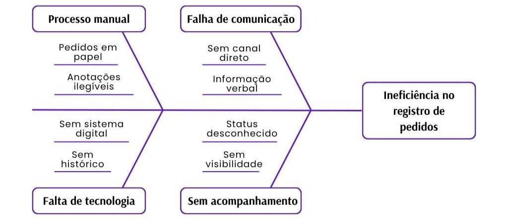

# Documento de Visão

**Nexus Gourmet**

Versão 1.4

## Integrantes do Grupo

| Matrícula   | Nome                                                | Função (responsabilidade) | Pontos |
|-------------|-----------------------------------------------------|---------------------------|--------|
| 242004457   | Alexandre Henrique Almeida Valadares Sousa          | Banco de dados            | 10     |
| 242028655   | Davi Kenichi Watanabe Sakai                         | Frontend                  | 10     |
| 241025953   | Igor Lima Carneiro                                  | Backend                   | 10     |
| 242005329   | Jhonatan William Araújo de Almeida                  | Banco de dados            | 10     |
| 242015432   | João Gabriel Rolim Veiga                            | Backend                   | 10     |
| 241039322   | João Paulo Jacomini Batista                         | Frontend                  | 10     |
| 241039304   | João Victor Amorim Kurihara                         | Frontend                  | 10     |
| 242024253   | Lucas Ferreira Santana                              | Backend                   | 10     |
| 242024271   | Lucas Peixoto Rodrigues                             | Backend                   | 10     |
| 242005006   | Rafael de Aquino Marinho                            | Frontend / MkDocs         | 10     |

## Histórico de Revisões

| Data       | Versão | Descrição                                                                                             | Autor             |
|------------|--------|-------------------------------------------------------------------------------------------------------|-------------------|
| 30/04/2026 | 1.0    | Criação da primeira versão do documento                                                               | Grupo Dijkstra    |
| 02/06/2026 | 1.1    | Adicionado menções diretas às fontes bibliográficas e atualização dos sprints                         | Grupo Dijkstra    |
| 18/06/2026 | 1.2    | Atualização das métricas e dos testes                                                                 | Igor e Lucas Peixoto |
| 25/06/2026 | 1.3    | Feitas atualizações baseadas na correção da primeira versão do documento                              | João Gabriel, Igor e Lucas Peixoto |
| 30/06/2026 | 1.4    | Atualização da tabela de métricas e adição de novos testes                                            | João Kurihara     |

---

## Sumário

- [1. Visão Geral do Produto](#1-visao-geral-do-produto)
  - [1.1 Problema](#11-problema)
  - [1.2 Declaração de posição do produto](#12-declaracao-de-posicao-do-produto)
  - [1.3 Objetivos do Produto](#13-objetivos-do-produto)
  - [1.4 Tecnologias a Serem Utilizadas](#14-tecnologias-a-serem-utilizadas)
- [2. Visão Geral do Projeto](#2-visao-geral-do-projeto)
  - [2.1 Ciclo de vida do projeto](#21-ciclo-de-vida-do-projeto)
  - [2.2 Organização do Projeto](#22-organizacao-do-projeto)
  - [2.3 Planejamento das Fases](#23-planejamento-das-fases)
  - [2.4 Matriz de Comunicação](#24-matriz-de-comunicacao)
  - [2.5 Gerenciamento de Riscos](#25-gerenciamento-de-riscos)
  - [2.6 Critérios de Replanejamento](#26-criterios-de-replanejamento)
- [3. Processo de Desenvolvimento de Software](#3-processo-de-desenvolvimento-de-software)
  - [3.1 Principais Práticas Adotadas](#31-principais-praticas-adotadas)
  - [3.2 Ferramentas de Suporte](#32-ferramentas-de-suporte)
- [4. Declaração de Escopo do Projeto](#4-declaracao-de-escopo-do-projeto)
  - [4.1 Backlog do produto](#41-backlog-do-produto)
  - [4.2 Perfis](#42-perfis)
  - [4.3 Cenários](#43-cenarios)
  - [4.4 Tabela de Backlog do Produto](#44-tabela-de-backlog-do-produto)
- [5. Métricas e Medições](#5-metricas-e-medicoes)
  - [5.1 GQM de medições](#51-gqm-de-medicoes)
- [6. Testes de Software](#6-testes-de-software)
  - [6.1 Estratégia de testes](#61-estrategia-de-testes)
  - [6.2 Roteiro de teste](#62-roteiro-de-teste)
- [7. Referências Bibliográficas](#7-referencias-bibliograficas)

---

## 1. Visão Geral do Produto

### 1.1 Problema

Segundo a Associação Brasileira de Bares e Restaurantes (ABRASEL, 2018), aproximadamente 50% dos estabelecimentos do setor encerram suas atividades em menos de dois anos de operação. A causa raiz desse declínio raramente está ligada à qualidade da comida, e sim decorrente de falhas na gestão de pedidos, descontrole de estoque e ineficiência na comunicação interna.

O gerenciamento manual de pedidos, baseado em comandas de papel e interações verbais, está fadado ao erro (ALELO, 2024). O fluxo de informações em um restaurante é dinâmico e demanda alta carga cognitiva, onde a perda de um único pedaço de papel pode significar a interrupção de toda a experiência do cliente e a perda direta de receita (CLOUDFY, 2025).

A anotação em papel é uma interface de entrada de dados de baixíssima fidelidade, sujeita a ambiguidades de caligrafia, falta de padronização em observações e total ausência de dados temporais. Sem o registro exato do momento em que o pedido foi feito, a cozinha perde a capacidade de medir o tempo médio de preparo, informação vital para a eficiência operacional do restaurante, uma vez que a agilidade é um dos fatores mais valorizados pelos consumidores modernos.

Um sistema eletrônico de comandas, além da praticidade, ainda agiliza o atendimento e entrega de informações, facilita o fechamento do caixa e otimiza o tempo (CHAVES, 2026).

Focando na falta de rastreabilidade, falhas de comunicação entre salão e cozinha e desorganização logística, conforme ilustrado na Figura 1, revela-se a necessidade de desenvolver um software que solucione a problemática do registro e acompanhamento de pedidos.

O sistema deve permitir a entrada de pedidos via dispositivos móveis (garçons) e enviá-los imediatamente para telas na cozinha, organizando-os por prioridade e tempo de preparo, eliminando a necessidade de impressoras, além de possuir interfaces intuitivas que exijam o mínimo de treinamento possível para a equipe, considerando a alta rotatividade de funcionários no setor de *foodservice*.

*Fonte: realizado pelo autor (2026)*

### 1.2 Declaração de posição do produto

A tabela 1 condensa o posicionamento estratégico do Nexus Gourmet, apresentando seu público-alvo, necessidade no ambiente, sua categoria e vantagens em relação às alternativas existentes.

**Tabela 1 - Posicionamento estratégico do produto**

| Item               | Descrição                                                                                                                              |
|--------------------|----------------------------------------------------------------------------------------------------------------------------------------|
| **Para**           | Proprietários e funcionários de restaurantes de qualquer porte                                                                          |
| **Necessidade**    | Registrar, acompanhar e gerenciar pedidos de forma centralizada, ágil e sem erros                                                       |
| **O Nexus Gourmet**| É uma aplicação denominada Nexus Gourmet                                                                                               |
| **Que**            | Permite o registro digital de pedidos por mesa, o acompanhamento do status em tempo real pela cozinha e o fechamento de conta pelos garçons |
| **Ao contrário**   | Do registro manual em papel e da comunicação verbal entre garçom e cozinha, que estão sujeitos a erros, perdas de informação e ausência de rastreabilidade |
| **Nosso produto**  | Integra o fluxo completo do pedido — do salão à cozinha — com atualização em tempo real                                                |

*Fonte: realizado pelo autor (2026)*

### 1.3 Objetivos do Produto

**Objetivo Principal**

O Nexus Gourmet objetiva, principalmente, desenvolver um software que centralize o processo de registro, acompanhamento e gerenciamento de pedidos de restaurantes, eliminando a dependência de anotações manuais.

**Objetivos Secundários**

- Melhorar o gerenciamento de insumos consumidos pelo cliente.
- Oferecer visibilidade em tempo real do status de cada pedido (NOX, 2025; OLITECNICA, 2025).
- Facilitar o gerenciamento de mesas (THEFORKMANAGER, 2025).
- Automatizar o cálculo e a geração da conta ao final do atendimento.

### 1.4 Tecnologias a Serem Utilizadas

- **Frontend:** React & Vite
- **Backend:** Python com Flask
- **Banco de Dados:** MySQL
- **Ferramentas adicionais:** GitHub, Microsoft Word, Visual Studio Code

---

## 2. Visão Geral do Projeto

### 2.1 Ciclo de vida do projeto de desenvolvimento de software

Para o desenvolvimento do sistema de gerenciamento de pedidos, adotamos uma abordagem embasada nas práticas ágeis. Essa escolha se justifica pela necessidade de entregas contínuas, validação constante com os usuários finais e a capacidade de adaptação a requisitos dinâmicos característicos do setor de *foodservice*. A seguir, detalhamos a instanciação do ciclo de vida do projeto com base na arquitetura de metodologias:

#### 2.1.1 Metodologia: Metodologia Ágil

A escolha pela agilidade se dá pelo foco na entrega de valor e pela flexibilidade. Como o ambiente de restaurantes exige alta usabilidade e eficiência operacional, uma abordagem ágil permite que o grupo ajuste prioridades no Backlog do Produto e planeje o escopo conforme os riscos são identificados e mitigados, sem engessar o desenvolvimento.

#### 2.1.2 Processo

Utilizaremos um processo orientado pelo **Scrumban** (uma abordagem híbrida que combina a estrutura do Scrum com o fluxo contínuo do Kanban), apoiado por práticas de engenharia do **XP** (*Extreme Programming*). O Scrumban nos permite manter os papéis definidos (Dono do Produto, Desenvolvedores e Analistas de Qualidade) e o planejamento em ciclos curtos de uma semana (Sprints), mas com a adoção de um fluxo contínuo (sistema pull) e limites de trabalho em andamento (WIP) para evitar gargalos na equipe.

#### 2.1.3 Procedimentos

O trabalho fluirá através de iterações baseadas em Sprints, iniciando com uma *Sprint Planning* para puxar as tarefas prioritárias (como as funcionalidades *Must*) para o quadro de desenvolvimento. O acompanhamento diário e o gerenciamento de riscos serão guiados visualmente pelo quadro Kanban, garantindo transparência do que está a fazer, em andamento e concluído. Ao final do ciclo, as entregas passarão por avaliações de qualidade baseadas nas métricas do GQM.

#### 2.1.4 Métodos

- **Quadro Kanban e Limites de WIP:** Gestão visual do fluxo de tarefas para identificar rapidamente impedimentos e limitar a quantidade de itens em desenvolvimento simultâneo, garantindo foco na conclusão.
- **Histórias de usuário:** Utilizadas para mapear o Backlog do produto de forma focada (Administrador, Garçom, Cozinheiro).
- **Testes de Software:** Implementação de testes para mitigar riscos de comunicação entre interfaces, buscando manter a densidade de erros de programa em níveis mínimos (≤ 0,5%).
- **Refatoração Contínua:** Prática do XP para manter o código limpo e otimizado, assegurando os tempos de execução e de comunicação em tempo real esperados pelo sistema.

#### 2.1.5 Ferramentas

- **Codificação:** Visual Studio Code utilizando React para o frontend e Python com Flask e MySQL para o backend.
- **Design e Prototipagem:** Figma, para desenhar interfaces intuitivas e responsivas.
- **Versionamento e Gestão:** Git, centralizando o código no GitHub, que também poderá ser utilizado para a gestão visual do Kanban.
- **Comunicação da Equipe:** Teams, Discord e WhatsApp.

### 2.2 Organização do Projeto

A tabela 2 apresenta as atribuições e deveres de cada membro do grupo, ou seja, as responsabilidades escolhidas pelos membros participantes.

**Tabela 2 - Divisão de funções**

| Papel               | Atribuições                                                                                             | Responsável                         | Participantes                                                                     |
|---------------------|---------------------------------------------------------------------------------------------------------|-------------------------------------|-----------------------------------------------------------------------------------|
| Desenvolvedor       | Responsáveis por fazer com que o projeto funcione através das iterações de código e banco de dados      | Igor, Davi Sakai, João Gabriel, Jhonatan William | Igor, Davi Sakai, João Gabriel, João Amorim, Jhonatan William                     |
| Dono do Produto     | Validar os requisitos e backlog do produto, representando o cliente na equipe                           | Rafael de Aquino                    | Rafael de Aquino                                                                  |
| Analista de Qualidade | Avaliar a qualidade do produto e decidir se a iteração está pronta, de acordo com o conceito de pronto | Lucas Peixoto, Alexandre, Lucas Ferreira | Lucas Peixoto, Alexandre, Lucas Ferreira                                        |
| Cliente (monitor)   | Avaliar se o projeto está de acordo com os requisitos e proposta inicial                                | Lucas Ferreira                      | Lucas Ferreira                                                                    |

*Fonte: realizado pelo autor (2026)*

### 2.3 Planejamento das Fases e/ou Iterações do Projeto

O planejamento de Fases tem como objetivo demonstrar o que foi feito em cada sprint, o período que ela durou e as entregas feitas durante ou ao final da iteração. O planejamento também deixa claro qual o grau de conclusão do projeto. A tabela 3 abaixo apresenta esses dados.

**Tabela 3 - Planejamento das fases**

| Sprint   | Produto (Entrega)                                                     | Data Início | Data Fim   | Entregável(eis)                                                             | Responsáveis                                                                   | % conclusão |
|----------|-----------------------------------------------------------------------|-------------|------------|-----------------------------------------------------------------------------|--------------------------------------------------------------------------------|-------------|
| Sprint 1 | Definição geral do produto                                            | 09/04/2026  | 16/04/2026 | -                                                                           | Todos                                                                          | 2%          |
| Sprint 2 | Planejamento do projeto e DV                                          | 23/04/2026  | 30/04/2026 | 1ª versão do Documento de Visão                                            | Todos                                                                          | 7%          |
| Sprint 3 | Documento de arquitetura                                              | 30/04/2026  | 14/05/2026 | 1ª versão do Documento de arquitetura                                      | Todos                                                                          | 13%         |
| Sprint 4 | Preparação do Github                                                  | 20/05/2026  | 28/05/2026 | Pastas e documentos no git                                                  | Todos                                                                          | 18%         |
| Sprint 5 | Início do Desenvolvimento                                             | 28/05/2026  | 04/06/2026 | Models, Controllers e Services; atualização dos documentos                  | Igor Lima, João Gabriel, Lucas Ferreira, Lucas Peixoto                        | 20%         |
| Sprint 6 | Integração dos models, services e controllers; desenvolvimento do BD | 04/06/2026  | 11/06/2026 | Banco de dados + atualizações do backend                                    | Alexandre, Igor Lima, Jhonatan, João Gabriel, Lucas Ferreira, Lucas Peixoto | 45%         |
| Sprint 7 | Integração das camadas e desenvolvimento Frontend                    | 11/06/2026  | 18/06/2026 | Entrega da view de login e do administrador                                 | Davi, João Paulo, João Victor, Rafael                                        | 65%         |
| Sprint 8 | Finalização e testes                                                  | 18/06/2026  | 25/06/2026 | Testes integrados e unitários; ajustes finais                               | Todos                                                                          | 90%         |
| Sprint 9 | Entrega final                                                         | 25/06/2026  | 30/06/2026 | Documentação final e apresentação                                           | Todos                                                                          | 100%        |

*Fonte: Elaborado pelo autor (2026)*

### 2.4 Matriz de Comunicação

A tabela 4 apresenta como serão feitas as comunicações entre o grupo e a monitora. Além disso, mostrará quais são as fontes de informação geradas pelo grupo, sobre o projeto, e onde elas estarão disponíveis para a consulta das iterações.

**Tabela 4 - Matriz de comunicação**

| Descrição                                                                                                        | Área/Envolvidos              | Periodicidade | Produtos Gerados                                       |
|------------------------------------------------------------------------------------------------------------------|------------------------------|---------------|--------------------------------------------------------|
| Acompanhamento das atividades em andamento via Teams, WhatsApp e acompanhamento dos riscos, compromissos, ações pendentes via GitHub | Equipe do Projeto            | Semanal       | Ata de reunião, Relatório de situação do projeto       |
| Acompanhamento dos riscos, compromissos, ações pendentes via GitHub                                              | Equipe do Projeto            | Quinzenal     | Ata de reunião, Relatório de situação do projeto       |
| Comunicar a situação do projeto                                                                                  | Equipe do Projeto + monitor  | Semanal       | Ata de reunião, Relatório de situação do projeto       |

*Fonte: Elaborado pelo autor (2026)*

### 2.5 Gerenciamento de Riscos

O Gerenciamento de Riscos consiste na identificação, avaliação, priorização, tratamento e monitoramento de possíveis ameaças tanto internas quanto externas. O objetivo de aplicar o gerenciamento de riscos no projeto é promover a continuidade, a segurança no trabalho, a tomada de decisões e a redução de custos.

A tabela 5 logo a seguir mostra os principais riscos que podemos vir a enfrentar durante as etapas do projeto, a tabela classifica os riscos em alto, médio ou baixo, além de propor estratégias de mitigação e plano de contingência.

**Tabela 5 - Gerenciamento de riscos**

| Risco                                                                 | Grão de exposição | Mitigação                                                               | Plano de contingência                                                                   |
|-----------------------------------------------------------------------|-------------------|-------------------------------------------------------------------------|------------------------------------------------------------------------------------------|
| Alteração de requisitos do backlog do produto após o início da sprint | Alto              | Aumentar o período de refinamento do backlog do produto                 | Reunir os requisitos já acordados e aumentar o grau de prioridade                         |
| Falta de comunicação entre as interfaces do sistema                   | Alto              | Implementação de Testes de Software para garantir a redução de atrasos | Revisão completa de todas as unidades do código em larga escala para solução do problema |
| Dificuldades com as tecnologias usadas no projeto (SQL, Flask, etc.)  | Médio             | Preparação rápida para a implementação básica dessas tecnologias        | Solicitar ajuda externa (monitores, professores, tutores etc.)                           |
| Concentração de conhecimento em poucos integrantes                    | Baixo             | Documentação técnica no GitHub/GitHub Pages; rodízio leve em revisões de código | Redistribuir responsabilidades entre membros com contexto próximo à área afetada |
| Conflitos de merge/versionamento entre membros                        | Médio             | Commits pequenos e frequentes; comunicação de qual branch/feature está sendo trabalhada | Resolver conflito em pair review antes de finalizar o merge |

*Fonte: Elaborado pelo autor (2026)*

### 2.6 Critérios de Replanejamento

A seguir, a tabela 6 apresenta os critérios de replanejamento e as ações que serão tomadas para replanejar os seguimentos afetados:

**Tabela 6 - Critérios de replanejamento**

| Risco                               | Critério de Replanejamento                                                                | Ação de Replanejamento                                                   |
|-------------------------------------|-------------------------------------------------------------------------------------------|--------------------------------------------------------------------------|
| Atraso na entrega de funcionalidades | Atraso igual ou superior a 1 sprint na entrega de uma funcionalidade em relação ao cronograma | Alterar as prioridades de entrega e ajustar o backlog                   |
| Necessidade de alterar o escopo     | Funcionalidades Must não estão sendo realizadas de acordo com o cronograma planejado     | Replanejar as funcionalidades que seriam trabalhadas em sprints futuras |
| Falta de comunicação entre os membros do projeto | Dificuldade de comunicação com um membro por 3 dias                                     | Ajustes na divisão e nas responsabilidades atribuídas aos membros       |

*Fonte: Elaborado pelo autor (2026)*

---

## 3. Processo de Desenvolvimento de Software

Conforme apresentado na Seção 2.1, o desenvolvimento do sistema Nexus Gourmet será conduzido com base na metodologia ágil, por meio da abordagem híbrida Scrumban, complementada por práticas de engenharia de software oriundas do Extreme Programming (XP). Essa combinação visa proporcionar flexibilidade, organização e melhoria contínua ao longo de todo o ciclo de vida do projeto.

### 3.1 Principais Práticas Adotadas

Para garantir a agilidade e a qualidade do software, a equipe adotou as seguintes práticas:

- **Sprint Planning:** Reunião realizada no início de cada Sprint com o objetivo de selecionar, priorizar e detalhar as funcionalidades a serem desenvolvidas, definindo metas e responsabilidades para a equipe.
- **Sprint Review:** Encontro ao término de cada Sprint para apresentação das funcionalidades implementadas e validação junto ao cliente ou monitor.
- **Sprint Retrospective:** Reunião destinada à reflexão sobre o processo de desenvolvimento, identificando pontos de melhoria e oportunidades de aperfeiçoamento.
- **Gestão Visual com Kanban:** Utilização de quadro Kanban para monitoramento contínuo das tarefas, organizadas em colunas que representam o fluxo de trabalho (a fazer, em andamento, em validação e concluído).
- **Limitação de WIP (Work in Progress):** Estabelecimento de limites para o número de tarefas em andamento simultaneamente, a fim de reduzir sobrecarga e evitar gargalos.
- **Pair Programming (XP):** Prática aplicada em funcionalidades críticas ou de maior complexidade, promovendo colaboração, compartilhamento de conhecimento e redução de defeitos.
- **Code Review (XP):** Revisão sistemática do código desenvolvido, garantindo conformidade com padrões de qualidade, legibilidade e manutenção.
- **Testes Contínuos (XP):** Execução de testes unitários, de integração e testes manuais durante todo o desenvolvimento, assegurando a qualidade incremental do produto.
- **Refinamento Contínuo do Backlog:** Atualização periódica do Backlog do Nexus Gourmet com base no feedback do cliente, nas prioridades de negócio e nas necessidades identificadas pela equipe.

### 3.2 Ferramentas de Suporte

Para apoiar a execução do processo, serão utilizadas ferramentas de colaboração, comunicação, versionamento e documentação:

- **Versionamento:** Git + GitHub
- **Documentação:** GitHub Pages
- **Prototipagem:** Figma
- **Comunicação:** Teams, Discord e WhatsApp

A tabela 7 a seguir detalha as responsabilidades de cada papel dentro do projeto, adaptada para o formato de gestão profissional do sistema.

**Tabela 7 - Papéis**

| Papel               | Responsabilidades                                                                                               | Integrantes                                                                                  |
|---------------------|-----------------------------------------------------------------------------------------------------------------|----------------------------------------------------------------------------------------------|
| Dono do produto     | Validar os requisitos e o backlog do produto, atuando como representante do cliente na equipe                  | Rafael de Aquino                                                                             |
| Desenvolvedores     | Implementação técnica do sistema, incluindo código, banco de dados e iterações de desenvolvimento              | Davi Sakai, Igor Lima, Jhonatan William, João Gabriel, João Amorim e João Paulo              |
| Analistas de Qualidade | Avaliar a qualidade do produto e validar se as iterações estão prontas conforme o conceito de "pronto" do time | Alexandre Sousa, Lucas Peixoto e Lucas Ferreira                                              |
| Cliente             | Avaliar se o projeto está de acordo com os requisitos e a proposta inicial do Nexus Gourmet                    | Lucas Ferreira                                                                               |

A figura 2 abaixo apresenta o ciclo de vida de desenvolvimento adotado para o projeto **Nexus Gourmet**, representando as fases principais de planejamento, desenvolvimento, revisão, retrospectiva e refinamento do backlog.

*Fonte: Elaborada pelos autores (2026)*

---

## 4. Declaração de Escopo do Projeto

### 4.1 Backlog do produto

A Tabela 8 apresenta o backlog do produto, composto pelo conjunto de funcionalidades identificadas para o sistema. Cada funcionalidade está descrita de forma objetiva e classificada por nível de prioridade, servindo como base para o planejamento das sprints e para o acompanhamento do desenvolvimento ao longo do projeto.

**Tabela 8 - Backlog**

| ID  | Funcionalidade                | Descrição                                                                                              | Prioridade | Dependências                        |
|-----|-------------------------------|--------------------------------------------------------------------------------------------------------|------------|-------------------------------------|
| F01 | abrir_comanda                 | O garçom deve poder abrir um pedido vinculado a uma mesa                                              | Alta       | F14 (Mesa cadastrada)               |
| F02 | adicionar_item                | O garçom deve poder adicionar itens do cardápio a um pedido em aberto                                 | Alta       | F01, F11                            |
| F03 | listar_usuario                | Lista todos os usuários do sistema                                                                    | Média      | F02                                 |
| F04 | enviar_comanda                | O garçom deve poder enviar o pedido, alterando seu status para "em preparo"                           | Alta       | F02                                 |
| F05 | visualizar_comanda            | O cozinheiro deve poder visualizar todos os pedidos ativos organizados por status                     | Alta       | F04                                 |
| F06 | visualizar_tempo_espera       | O cozinheiro deve poder visualizar o tempo decorrido desde a abertura de cada pedido                  | Alta       | F04                                 |
| F07 | alterar_status                | O cozinheiro deve poder marcar um pedido como "em preparo" ou "pronto"                                | Alta       | F05                                 |
| F08 | fechar_comanda                | O garçom deve poder fechar a conta de uma mesa, gerando o total e liberando a mesa                    | Alta       | F01                                 |
| F09 | calcular_total                | O sistema deve calcular automaticamente o valor total do pedido com base nos itens e quantidades      | Alta       | F02                                 |
| F10 | listar_mesas                  | O sistema deve exibir todas as mesas do restaurante com seus respectivos status                       | Alta       | F14                                 |
| F11 | cadastrar_produto             | O administrador deve poder cadastrar novos produtos no cardápio, informando nome, categoria e preço   | Média      | F01                                 |
| F12 | editar_comanda                | O administrador deve poder editar as informações de um produto já cadastrado                          | Média      | F11                                 |
| F13 | deletar_produto               | O administrador deve poder remover um produto do cardápio                                             | Média      | F11                                 |
| F14 | criar_mesa                    | O administrador deve poder cadastrar novas mesas, informando número e capacidade                      | Alta       | -                                   |
| F15 | editar_mesa                   | O administrador deve poder editar as informações de uma mesa já cadastrada                            | Média      | F14                                 |
| F16 | deletar_mesa                  | O administrador deve poder remover uma mesa do sistema                                                | Média      | F14                                 |
| F17 | setup_routes                  | Seta as rotas                                                                                         | Alta       | -                                   |
| F18 | get_usuario_logado            | Pega o usuário já logado para redirecioná-lo                                                          | Alta       | -                                   |
| F19 | listar_comanda_mesa           | Lista comandas específicas de uma mesa específica                                                     | Alta       | -                                   |
| F20 | listar_todas_comandas         | Lista todas as comandas de uma mesa específica                                                        | Alta       | -                                   |
| F21 | gerar_conta                   | Gera a conta                                                                                          | Alta       | -                                   |
| F22 | get_order_by_id               | Busca a comanda pelo ID da comanda                                                                    | Alta       | -                                   |
| F23 | open_order_counter            | Diz quantos pedidos uma mesa tem                                                                      | Alta       | -                                   |
| F24 | listar_produtos               | Lista todos os produtos                                                                               | Alta       | -                                   |
| F25 | listar_por_categoria          | Lista todos os produtos por categoria                                                                 | Alta       | -                                   |
| F26 | liberar_mesa                  | Libera a mesa para outro cliente                                                                      | Alta       | -                                   |
| F27 | get_table_by_number           | Busca a mesa pelo número da mesa                                                                      | Alta       | -                                   |
| F28 | autenticar                    | Realiza o login do usuário                                                                            | Alta       | -                                   |
| F29 | logout                        | Realiza o logout do usuário                                                                           | Alta       | -                                   |
| F30 | cadastrar_usuario             | Permite ao administrador cadastrar um usuário                                                         | Alta       | -                                   |
| F31 | deletar_usuario               | Permite ao administrador deletar um usuário                                                           | Alta       | -                                   |
| F32 | meu_perfil                    | Permite ao usuário visualizar seu próprio cargo                                                       | Alta       | -                                   |
| F33 | visualizar_perfil             | Permite ao administrador visualizar um perfil de usuário                                              | Média      | -                                   |
| F34 | estatisticas_diarias          | Mostra as estatísticas do dia                                                                         | Média      | -                                   |
| F35 | get_product_by_id             | Busca um produto pelo ID do produto                                                                   | Alta       | -                                   |
| F36 | get_user_by_id                | Busca um usuário pelo ID do usuário                                                                   | Alta       | -                                   |
| F37 | editar_produto                | Edita um produto cadastrado                                                                           | Alta       | -                                   |

*Fonte: Elaborado pelo autor (2026)*

### 4.2 Perfis

A Tabela 9 apresenta os perfis de usuário do sistema, descrevendo o papel de cada ator no contexto do restaurante e as responsabilidades atribuídas dentro da aplicação. A definição dos perfis orienta a construção das *user stories* e dos casos de uso detalhados nas seções seguintes.

**Tabela 9: Perfis de acesso**

| #  | Nome do perfil | Características do perfil                           | Permissões de acesso                                                                   |
|----|----------------|-----------------------------------------------------|-----------------------------------------------------------------------------------------|
| P01| Administrador  | Responsável pela gestão operacional do sistema      | Cadastrar, editar e remover produtos do cardápio e mesas do restaurante                 |
| P02| Garçom         | Funcionário responsável pelo atendimento no salão   | Abrir pedidos, registrar itens, enviar pedidos para a cozinha e fechar contas           |
| P03| Cozinheiro     | Funcionário responsável pelo preparo dos pedidos    | Visualizar pedidos ativos, acompanhar tempo de espera e atualizar status dos pedidos    |

*Fonte: Elaborado pelo autor (2026)*

### 4.3 Cenários

A Tabela 10 organiza exemplos práticos de como os usuários interagem com o sistema, conectando requisitos a situações reais de uso. Ela orienta o desenvolvimento das funcionalidades e evita desvios do escopo. Os itens não possuem sprint definida, pois foram deixados para planejamentos futuros, reduzindo expectativas irreais. A tabela seguinte apresenta esses cenários, com ator, contexto, passos e resultado esperado:

**Tabela 10: Cenários funcionais**

| # | Ator           | Contexto                                | Passos                                                                                  | Sprints |
|---|----------------|-----------------------------------------|-----------------------------------------------------------------------------------------|---------|
| 1 | Administrador  | Deseja registrar uma nova mesa          | Acessar "Cadastro de Mesas", preencher número, capacidade e salvar.                     |         |
| 2 | Garçom         | Deseja receber o pedido de uma mesa     | Selecionar a mesa desejada, clicar em "abrir pedido" e selecionar os itens desejados    |         |
| 3 | Cozinha        | Deseja despachar um pedido finalizado   | Selecionar o pedido e clicar em "pronto", para que o garçom venha retirar               |         |

*Fonte: Elaborado pelo autor (2026)*

### 4.4 Tabela de Backlog do Produto

**Tabela 11: Backlog do produto (detalhado)**

| Numeração (Cenário/requisito) | Sprint | Nome do requisito         | Tipo de requisito | Priorização | Descrição sucinta do requisito                                                                 | User stories (U.S.) associadas                          |
|-------------------------------|--------|---------------------------|-------------------|-------------|------------------------------------------------------------------------------------------------|---------------------------------------------------------|
| C2/F01                        | 5      | Abrir comanda             | Funcional         | Must        | Permitir que o garçom abra uma comanda vinculada a uma mesa cadastrada.                       | US-GAR-01: Como garçom, quero abrir uma comanda para uma mesa, para iniciar o atendimento. |
| C2/F02                        | 5      | Adicionar item            | Funcional         | Must        | Permitir adicionar produtos do cardápio a uma comanda em aberto.                              | US-GAR-02: Como garçom, quero adicionar itens à comanda, para registrar o consumo do cliente. |
| C1/F03                        | 5      | Listar usuários           | Funcional         | Should      | Permitir que o administrador visualize os usuários cadastrados no sistema.                    | US-ADM-05: Como administrador, quero listar usuários, para acompanhar os acessos do sistema. |
| C2/F04                        | 5      | Enviar comanda            | Funcional         | Must        | Permitir enviar a comanda para a cozinha, alterando o status para em preparo.                | US-GAR-03: Como garçom, quero enviar o pedido à cozinha, para iniciar o preparo.           |
| C3/F05                        | 7      | Visualizar comanda        | Funcional         | Must        | Permitir que a cozinha visualize comandas ativas organizadas por status.                      | US-COZ-01: Como cozinheiro, quero visualizar pedidos ativos, para organizar o preparo.    |
| C3/F06                        | 7      | Visualizar tempo de espera| Funcional         | Must        | Exibir o tempo decorrido desde a abertura ou envio da comanda.                                | US-COZ-02: Como cozinheiro, quero ver o tempo de espera, para priorizar pedidos atrasados.|
| C3/F07                        | 5      | Alterar status            | Funcional         | Must        | Permitir alterar o status da comanda, como em preparo ou pronto.                             | US-COZ-03: Como cozinheiro, quero atualizar o status do pedido, para informar o andamento.|
| C2/F08                        | 5      | Fechar comanda            | Funcional         | Must        | Permitir fechar a conta da mesa, gerar total e encerrar a comanda.                           | US-GAR-04: Como garçom, quero fechar a comanda, para concluir o atendimento.              |
| C2/F09                        | 6      | Calcular total            | Funcional         | Must        | Calcular automaticamente o total com base nos itens e quantidades.                           | US-GAR-05: Como garçom, quero ver o total da comanda, para informar o valor ao cliente.   |
| C1/F10                        | 5      | Listar mesas              | Funcional         | Must        | Exibir as mesas do restaurante com seus respectivos status.                                   | US-GAR-06: Como garçom, quero visualizar mesas, para selecionar onde abrir ou acompanhar pedidos. |
| C1/F11                        | 5      | Cadastrar produto         | Funcional         | Should      | Permitir cadastrar produtos com nome, categoria e preço.                                     | US-ADM-01: Como administrador, quero cadastrar produtos, para manter o cardápio atualizado. |
| C1/F12                        | 5      | Editar produto            | Funcional         | Should      | Permitir editar informações de produto já cadastrado.                                        | US-ADM-02: Como administrador, quero editar produtos, para corrigir ou atualizar o cardápio.|
| C1/F13                        | 5      | Deletar produto           | Funcional         | Should      | Permitir remover produto do cardápio.                                                         | US-ADM-03: Como administrador, quero remover produtos, para retirar itens indisponíveis.   |
| C1/F14                        | 5      | Criar mesa                | Funcional         | Must        | Permitir cadastrar mesas com número e capacidade.                                            | US-ADM-04: Como administrador, quero cadastrar mesas, para organizar o salão.              |
| C1/F15                        | 5      | Editar mesa               | Funcional         | Should      | Permitir editar informações de mesa já cadastrada.                                           | US-ADM-06: Como administrador, quero editar mesas, para corrigir dados do salão.           |
| C1/F16                        | 5      | Deletar mesa              | Funcional         | Should      | Permitir remover mesa do sistema.                                                             | US-ADM-07: Como administrador, quero remover mesas, para manter o cadastro correto.        |
| T/F17                         | 5      | Configurar rotas          | Funcional         | Must        | Configurar as rotas principais da aplicação para acesso às funcionalidades.                  | US-TEC-01: Como sistema, preciso ter rotas configuradas, para conectar usuários aos recursos.|
| C0/F18                        | 5      | Obter usuário logado      | Funcional         | Must        | Identificar o usuário autenticado para redirecionamento e controle de acesso.                | US-AUT-01: Como usuário autenticado, quero ser reconhecido pelo sistema, para acessar meu perfil correto. |
| C2/F19                        | 5      | Listar comandas da mesa   | Funcional         | Must        | Listar comandas vinculadas a uma mesa específica.                                            | US-GAR-07: Como garçom, quero ver comandas de uma mesa, para acompanhar o atendimento.    |
| C2/F20                        | 5      | Listar todas as comandas  | Funcional         | Must        | Listar comandas registradas no sistema para acompanhamento operacional.                      | US-GER-01: Como equipe do restaurante, quero listar comandas, para acompanhar os pedidos.  |
| C2/F21                        | 7      | Gerar conta               | Funcional         | Must        | Gerar a conta da comanda com itens, quantidades e valor total.                               | US-GAR-08: Como garçom, quero gerar a conta, para apresentar o consumo ao cliente.        |
| C2/F22                        | 7      | Buscar comanda por ID     | Funcional         | Must        | Buscar uma comanda a partir de seu identificador.                                            | US-GAR-09: Como garçom, quero consultar uma comanda específica, para verificar seus dados.|
| C2/F23                        | 7      | Contar comandas abertas   | Funcional         | Must        | Informar quantas comandas abertas existem para uma mesa.                                    | US-GAR-10: Como garçom, quero saber quantas comandas a mesa possui, para evitar confusão no atendimento. |
| C1/F24                        | 5      | Listar produtos           | Funcional         | Must        | Listar todos os produtos cadastrados no cardápio.                                            | US-GAR-11: Como garçom, quero listar produtos, para escolher itens ao montar o pedido.    |
| C1/F25                        | 5      | Listar produtos por categoria | Funcional | Must        | Filtrar produtos por categoria.                                                               | US-GAR-12: Como garçom, quero filtrar produtos por categoria, para encontrar itens rapidamente. |
| C2/F26                        | 5      | Liberar mesa              | Funcional         | Must        | Liberar mesa após fechamento da conta.                                                        | US-GAR-13: Como garçom, quero liberar a mesa após o pagamento, para permitir novo atendimento. |
| C1/F27                        | 6      | Buscar mesa por número    | Funcional         | Must        | Buscar dados de uma mesa pelo número.                                                         | US-GAR-14: Como garçom, quero buscar mesa por número, para localizar rapidamente o atendimento. |
| C0/F28                        | 5      | Autenticar                | Funcional         | Must        | Realizar login do usuário no sistema.                                                         | US-AUT-02: Como usuário, quero fazer login, para acessar as funcionalidades autorizadas.   |
| C0/F29                        | 5      | Logout                    | Funcional         | Must        | Encerrar a sessão do usuário autenticado.                                                     | US-AUT-03: Como usuário, quero sair do sistema, para proteger minha sessão.               |
| C1/F30                        | 5      | Cadastrar usuário         | Funcional         | Must        | Permitir que o administrador cadastre usuários.                                              | US-ADM-08: Como administrador, quero cadastrar usuários, para controlar o acesso ao sistema. |
| C1/F31                        | 5      | Deletar usuário           | Funcional         | Must        | Permitir que o administrador remova usuários.                                                | US-ADM-09: Como administrador, quero deletar usuários, para bloquear acessos indevidos.   |
| C0/F32                        | 7      | Meu perfil                | Funcional         | Must        | Permitir que o usuário visualize seu próprio cargo/perfil.                                   | US-AUT-04: Como usuário, quero visualizar meu perfil, para saber minhas permissões.       |
| C1/F33                        | 7      | Visualizar perfil         | Funcional         | Should      | Permitir que o administrador visualize o perfil de um usuário.                               | US-ADM-10: Como administrador, quero visualizar perfis, para gerenciar permissões.        |
| C1/F34                        | 8      | Estatísticas diárias      | Funcional         | Should      | Exibir estatísticas operacionais do dia.                                                      | US-GER-02: Como gestor, quero ver estatísticas diárias, para acompanhar o desempenho do restaurante. |
| C1/F35                        | 5      | Buscar produto por ID     | Funcional         | Must        | Buscar produto pelo identificador.                                                            | US-ADM-11: Como administrador, quero consultar um produto específico, para conferir ou alterar seus dados. |
| C1/F36                        | 5      | Buscar usuário por ID     | Funcional         | Must        | Buscar usuário pelo identificador.                                                            | US-ADM-12: Como administrador, quero consultar um usuário específico, para revisar seus dados. |
| C1/F37                        | 5      | Atualizar produto         | Funcional         | Must        | Atualizar os dados de um produto cadastrado.                                                 | US-ADM-13: Como administrador, quero atualizar produtos, para manter o cardápio correto.   |

*Fonte: Elaborado pelo autor (2026)*

---

## 5. Métricas e Medições

### 5.1 GQM de medições

O *Goal Question Metrics* (GQM) foi elaborado com o intuito de estabelecer, através da tabela 12, as métricas do projeto, seguindo seu objetivo principal: desenvolver um software que centralize o processo de registro, acompanhamento e gerenciamento de pedidos de restaurantes.

As métricas foram definidas com base em:

1. Expectativas dos Stakeholders: Entrega de testes intermediários e produto funcional.
2. Riscos do projeto: Comunicação da equipe, cumprimento de prazos e qualidade do código.

**Tabela 12 - GQM do produto**

| Objetivo                            | Pergunta                                                      | Métrica                                     | Cálculo                                                                                     | Escala | Valor esperado       | Forma de análise                                           | Resultados                                                                                   |
|-------------------------------------|---------------------------------------------------------------|---------------------------------------------|---------------------------------------------------------------------------------------------|--------|----------------------|------------------------------------------------------------|----------------------------------------------------------------------------------------------|
| Validar taxa de conclusão da sprint| A sprint foi finalizada no período previsto?                 | Obediência ao período das sprints           | Número de atraso da entrega de todo o planejado em relação à sprint                         | unitária | 0                    | Implementação de Sprint Reviews e Sprint Meetings           | Sprint 1: 0, Sprint 2: 0, Sprint 3: 0, Sprint 4: 0, Sprint 5: 0, Sprint 6: 0, Sprint 7: 1, Sprint 8: 1, Sprint 9: 0 |
| Validar qualidade de implementação | O software está bem implementado?                            | Densidade de commits de correção de erros   | (Total de commits para correção) / (Total de commits) x 100%                                | %       | 40%                  | Realização de testes                                      | 22%                                                                                         |
| Obediência às sprints              | Os sprints estão entregando todos os musts?                  | Densidade de prorrogações de musts          | (Quantidade de musts prorrogados) / (Total de Musts da Sprint) x 100%                       | %       | ≤ 0%                 | Realizada em Sprint Reviews e Sprint Meetings              | Sprint 1: -, Sprint 2: -, Sprint 3: -, Sprint 4: -, Sprint 5: 0%, Sprint 6: 0%, Sprint 7: 16%, Sprint 8: -, Sprint 9: - |
| Usabilidade da Interface de usuário| A interface é intuitiva e perfeitamente utilizável?          | Densidade de feedback negativo               | (Reports negativos) / (Total de Reports) x 100%                                            | %       | ≤ 2%                 | Reuniões de alinhamento de requisitos e avaliação do cliente | 25%                                                                                         |
| Verificar usabilidade              | O programa é útil?                                            | Avaliação de utilidade                      | Média aritmética de avaliações                                                              | -       | ≥ 8                  | Demonstração e Feedback do cliente                        | 8                                                                                            |
| Verificar possível recomendação    | Recomendaria o software?                                     | Nível de recomendação binária               | Taxa de recomendações (%)                                                                   | %       | ≥ 80%                | Feedback do cliente                                        | 100%                                                                                         |

*Fonte: Elaborado pelo autor (2026)*

---

## 6. Testes de Software

### 6.1 Estratégia de testes contendo:

#### 6.1.1 Testes implementados em níveis

Os testes implementados no projeto permitem uma maior confiabilidade do código, e podem ser entendidos em níveis:

- **Testes Unitários:** Testam o código de forma isolada, validando a menor unidade funcional do mesmo, garantindo que cada componente da implementação responda corretamente às entradas fornecidas e eliminam custos de manutenção ao prevenir que bugs pequenos cheguem à produção.
- **Testes de Integração:** Verificam como diferentes partes do programa trabalham em conjunto para compor uma funcionalidade inteira, validam a comunicação e a interface entre dois ou mais módulos do sistema, investigam a existência de bugs que surgem apenas quando componentes isoladas são conectados entre si e testam a interação com elementos externos, como bancos de dados.
- **Testes de Sistema:** Testam e validam o software como um todo, garantindo que o produto final atende a todos os requisitos funcionais e técnicos do projeto. Eles garantem que o produto pronto seja meticulosamente o que foi planejado no escopo e avaliam não só as funções de um sistema, mas o desempenho, estabilidade e segurança.

#### 6.1.2 Testes Funcionais

Testes de software funcionais são fundamentais para validação e análise usabilidade de uma aplicação.

- **Testes Funcionais:** Trata-se de testes que verificam as funcionalidades de uma aplicação, é onde são testadas as regras de negócio: login funcional, bloqueio de sistema, registro de pedidos, execução de tarefas.

#### 6.1.3 Ambientes de Teste e Política de Branches e Commits

O projeto adota uma estrutura organizada de ambientes de teste integrada à sua política de versionamento de código, utilizando Git e GitHub como ferramentas principais.

##### 6.1.3.1 Ambientes de Teste

São definidos três ambientes principais ao longo do ciclo de desenvolvimento:

- **Ambiente de Desenvolvimento (Dev):** Utilizado para implementação e testes iniciais das funcionalidades. Os desenvolvedores trabalham localmente com as tecnologias do projeto, incluindo React & Vite no frontend, Python com Flask no backend e MySQL como banco de dados.
- **Ambiente de Homologação (QA):** Responsável pela validação das funcionalidades integradas. Neste ambiente, são realizados testes funcionais e não funcionais para garantir que o sistema atenda aos requisitos especificados.
- **Ambiente de Produção (Prod):** Ambiente final onde a aplicação é disponibilizada aos usuários. A documentação do sistema é publicada por meio do GitHub Pages.

##### 6.1.3.2 Política de Branches

A organização das branches segue uma estrutura baseada em fluxo contínuo de integração:

- **main:** Representa o ambiente de produção. Apenas código validado e estável é integrado a esta branch.
- **develop:** Representa o ambiente de homologação (QA), contendo funcionalidades já integradas e prontas para validação.
- **feature/&#42;:** Branches destinadas ao desenvolvimento de novas funcionalidades, derivadas da branch develop.

##### 6.1.3.3 Política de Commits e Integração

- Cada nova funcionalidade é desenvolvida em uma branch do tipo feature/&#42;, com commits frequentes e descritivos.
- Após conclusão, a feature é integrada à branch develop por meio de pull requests, passando por revisão de código.
- A branch develop é utilizada para testes no ambiente de homologação.
- Quando validado, o código é promovido para a branch main, sendo então disponibilizado em produção.

#### 6.1.4 Análise dos Testes

A análise de teste será baseada na comparação entre os resultados esperados do teste e o resultado do teste em si. Com base nessa comparação, no caso de resultados não esperados ou insatisfatórios, haverá uma investigação de falhas, correção de erros, medição de desempenho, retestagem e então documentação dos resultados.

### 6.2 Roteiro de teste:

Para minimizar os riscos no ambiente de teste e preservar a integridade do projeto, todos os testes planejados serão realizados em uma branch dedicada. Essa estratégia garante que possíveis erros ou modificações durante os testes não impactem o código principal do projeto.

**Pré-condição para testes**: fica determinado fazer na ordem dos códigos, assim, tudo estará pronto para o próximo passo.

#### Testes Unitários

*(Nota: Os testes unitários foram movidos para a página específica de Testes para facilitar a consulta. Consulte a aba "Testes" para visualizar todos os 70 testes unitários e os 33 testes integrados.)*

#### Testes Integrados

*(Nota: Os testes integrados foram movidos para a página específica de Testes para facilitar a consulta. Consulte a aba "Testes" para visualizar todos os 70 testes unitários e os 33 testes integrados.)*
---

## 7. Referências Bibliográficas

ABRASEL. **Solução KDS: ferramenta inovadora para auxiliar restaurantes**. Disponível em: [https://abrasel.com.br/noticias/noticias/solucao-kds-ferramenta-inovadora-para-auxiliar-restaurantes/](https://abrasel.com.br/noticias/noticias/solucao-kds-ferramenta-inovadora-para-auxiliar-restaurantes/).

ALELO. **Qual o melhor tipo de comanda para restaurante?**. Disponível em: [https://www.alelo.com.br/blog/estabelecimentos-comerciais/qual-o-melhor-tipo-de-comanda-para-restaurante](https://www.alelo.com.br/blog/estabelecimentos-comerciais/qual-o-melhor-tipo-de-comanda-para-restaurante).

CHAVES, K. **Comanda eletrônica: como funciona e os benefícios**. Disponível em: [https://www.kcms.com.br/blog/comanda-eletronica/](https://www.kcms.com.br/blog/comanda-eletronica/). Acesso em: 26 jun. 2026.

CLOUDFY. **Os desafios na gestão de pedidos em bares e restaurantes**. Disponível em: [https://www.cloudfy.net.br/blog/os-desafios-na-gestao-de-pedidos-em-bares-e-restaurantes.html](https://www.cloudfy.net.br/blog/os-desafios-na-gestao-de-pedidos-em-bares-e-restaurantes.html).

ECLETICA. **E-Garçom: Transformando o Atendimento em Restaurantes**. Disponível em: [https://ecletica.com.br/e-garcom-transformando-o-atendimento-restaurantes/](https://ecletica.com.br/e-garcom-transformando-o-atendimento-restaurantes/).

NOX. **Sistema KDS: O que é, para que serve e como otimiza sua cozinha e cafeteria?**. Disponível em: [https://nox.com.br/o-que-e-sistema-kds/?utm_medium=desktop](https://nox.com.br/o-que-e-sistema-kds/?utm_medium=desktop).

OLITECNICA. **KDS: A revolução na gestão de pedidos para restaurantes e delivery**. Disponível em: [https://www.olitecnica.com.br/post/kds-a-revolucao-na-gestao-de-pedidos-para-restaurantes-e-delivery](https://www.olitecnica.com.br/post/kds-a-revolucao-na-gestao-de-pedidos-para-restaurantes-e-delivery).

THEFORKMANAGER. **Restaurant Table Turnover Rate Optimization**. Disponível em: [https://www.theforkmanager.com/en/blog/restaurant-management/restaurant-table-turnover-tips-efficiency](https://www.theforkmanager.com/en/blog/restaurant-management/restaurant-table-turnover-tips-efficiency).